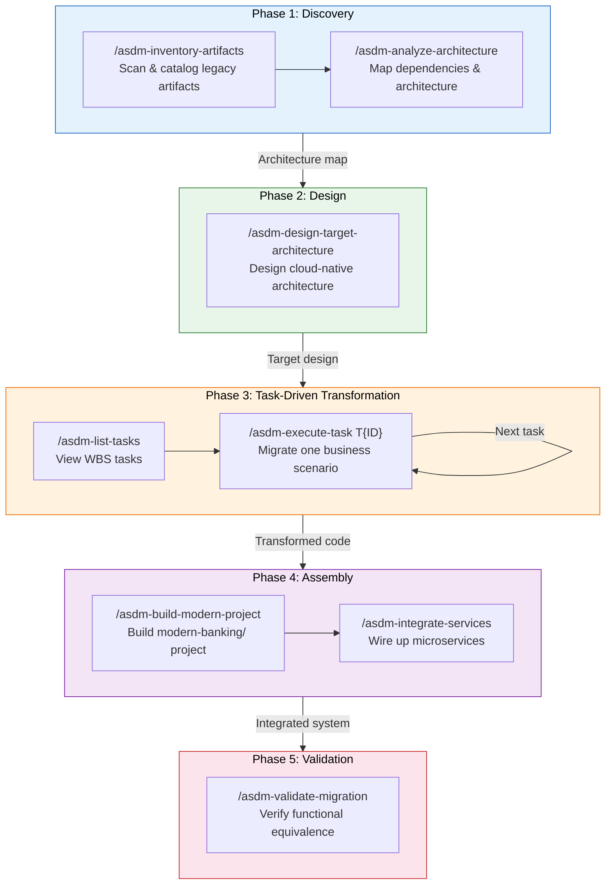
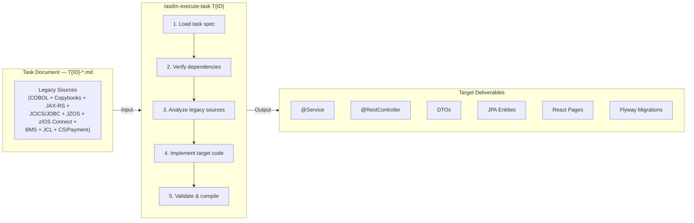

# ASDM Toolset - Mainframe Modernizer

toolset-id: mainframe-modernizer
toolset-name: Mainframe Modernizer
version: 1.0.0
updated-date: 2026-04-15
toolset-description: A general-purpose toolset for modernizing IBM CICS mainframe applications to cloud-native architectures, using task-driven migration with WBS-based work units.

## Overview

Mainframe Modernizer (toolset-id: mainframe-modernizer) is an ASDM toolset designed to modernize IBM CICS mainframe applications into cloud-native architectures. It guides AI-assisted development tools through a structured, phased approach to analyze, transform, and rebuild legacy mainframe code as modern microservices.

The toolset is **general-purpose** — it can be applied to any CICS mainframe migration project. Project-specific task definitions live in the workspace (`.asdm/workspace/planning/tasks/`), not in the toolset itself.

The toolset covers the full modernization lifecycle:

1. **Inventory & Analysis** — Scan and catalog all legacy artifacts (COBOL programs, JCL scripts, BMS maps, CICS resources, Java programs)
2. **Architecture Design** — Define the target cloud-native architecture and service boundaries
3. **Code Transformation** — Execute migration tasks defined in the WBS, each task migrating a complete business scenario across all legacy layers
4. **Rebuild & Integration** — Assemble the modernized codebase with proper project structure, APIs, and deployment configurations
5. **Validation & Testing** — Verify functional equivalence between legacy and modernized systems

## Source & Target

| Item | Path |
|------|------|
| **Legacy Source** | `cics-banking-sample-application-cbsa/` |
| **Modernized Target** | `modern-banking/` |
| **WBS Overview** | `.asdm/workspace/planning/03-wbs-overview.md` |
| **Task Documents** | `.asdm/workspace/planning/tasks/T{ID}-*.md` |

## Toolset Structure

```
.asdm/toolsets/mainframe-modernizer/
├── actions/
│   ├── asdm-inventory-artifacts.md          ## Scan and catalog all legacy artifacts
│   ├── asdm-analyze-architecture.md         ## Analyze the legacy architecture and map dependencies
│   ├── asdm-design-target-architecture.md   ## Design the target cloud-native microservices architecture
│   ├── asdm-list-tasks.md                   ## List migration tasks from the WBS with status and dependencies
│   ├── asdm-execute-task.md                 ## Execute a specific migration task using its task detail document
│   ├── asdm-build-modern-project.md         ## Assemble the modernized project structure
│   ├── asdm-integrate-services.md           ## Integrate microservices with API gateways and service mesh
│   └── asdm-validate-migration.md           ## Validate functional equivalence between legacy and modern systems
├── specs/
│   ├── inventory-spec.md                    ## Spec: rules for artifact inventory and classification
│   ├── architecture-analysis-spec.md        ## Spec: rules for legacy architecture analysis and dependency mapping
│   ├── target-architecture-spec.md          ## Spec: rules for target cloud-native architecture design
│   ├── task-execution-spec.md               ## Spec: rules for task document format and execution workflow
│   ├── project-structure-spec.md            ## Spec: rules for the modernized project directory structure
│   └── validation-spec.md                   ## Spec: rules for migration validation and equivalence testing
├── tools/
│   └── README.md                            ## Placeholder for CLI utility tools
├── INSTALL.md                               ## Installation guide for the toolset
└── README.md                                ## This file
```

## Actions & Specs Mapping

| Action | Spec | Description |
|--------|------|-------------|
| `asdm-inventory-artifacts` | `inventory-spec` | Walk through the legacy directory, identify and classify all artifacts, and produce an inventory report |
| `asdm-analyze-architecture` | `architecture-analysis-spec` | Analyze inter-program calls, CICS resource references, data flow, and transaction boundaries |
| `asdm-design-target-architecture` | `target-architecture-spec` | Design the target microservices architecture with service boundaries, API contracts, and data models |
| `asdm-list-tasks` | `task-execution-spec` | List all migration tasks from the WBS, showing status, priority, dependencies, and execution wave |
| `asdm-execute-task` | `task-execution-spec` | Execute a specific migration task by reading its task detail document and performing the transformation |
| `asdm-build-modern-project` | `project-structure-spec` | Assemble the complete modernized project with proper directory layout, build files, and configuration |
| `asdm-integrate-services` | `project-structure-spec` | Wire up microservice communication, API gateways, service discovery, and shared data access patterns |
| `asdm-validate-migration` | `validation-spec` | Verify functional equivalence by comparing legacy and modernized system behaviors |

## Modernization Workflow

The recommended sequence for using this toolset:

```
Phase 1: Discovery
  ├── /asdm-inventory-artifacts          →  Produce artifact inventory
  └── /asdm-analyze-architecture         →  Produce architecture map

Phase 2: Design
  └── /asdm-design-target-architecture   →  Produce target architecture

Phase 3: Transformation (Task-Driven)
  ├── /asdm-list-tasks                   →  See available tasks & choose next
  ├── /asdm-execute-task T0.1            →  Execute task (repeat for each)
  ├── /asdm-execute-task T1.1
  ├── /asdm-execute-task T1.2
  └── ...                                →  Continue through WBS waves

Phase 4: Assembly
  ├── /asdm-build-modern-project         →  Build modern-banking/ project
  └── /asdm-integrate-services           →  Wire up services

Phase 5: Validation
  └── /asdm-validate-migration           →  Verify equivalence
```

### Workflow Diagram



### Task-Driven Transformation

The Code Transformation phase is driven by the WBS task documents. Each task is a self-contained migration unit that covers all legacy technology layers for one business scenario:



## Task Documents

Task documents are **project-specific** and live in the workspace, not in the toolset. This keeps the toolset general-purpose and reusable.

```
.asdm/workspace/planning/
├── 03-wbs-overview.md              ## WBS with task index, dependencies, and execution waves
└── tasks/
    ├── T0.1-data-layer-foundation.md
    ├── T1.1-create-customer.md
    ├── T1.2-inquire-customer.md
    ├── T2.1-create-account.md
    ├── T3.1-credit-debit.md
    └── ...                          ## One file per WBS task
```

Each task document specifies:
- **Legacy Sources** — All artifacts to migrate (COBOL, Java, BMS, JCL, etc.)
- **Target Deliverables** — All files to create/modify in the modern project
- **Conversion Steps** — Ordered transformation instructions for the AI agent
- **Validation Criteria** — Checklist for task completion

## Target Technology Stack

| Layer | Technology |
|-------|-----------|
| **Runtime** | Java 17+ / Spring Boot 3.x |
| **UI** | React 18.3+ / TypeScript / Ant Design |
| **API** | REST / OpenAPI 3.0 |
| **Data** | Spring Data JPA / PostgreSQL |
| **Batch** | Spring Batch |
| **Migration** | Flyway |
| **Build** | Maven |
| **CI/CD** | GitHub Actions |
| **Container** | Docker / Kubernetes |

## Installation

See [INSTALL.md](INSTALL.md) for installation instructions.

## Usage

After installation, use the slash commands in order following the modernization workflow. For example:

```
/asdm-inventory-artifacts
/asdm-list-tasks
/asdm-execute-task T0.1
```

## Notes

- Actions are designed to be run sequentially following the phased workflow
- The Code Transformation phase (Phase 3) is task-driven — use `/asdm-list-tasks` to see available tasks and `/asdm-execute-task T{ID}` to execute one
- Each action references its corresponding spec for detailed rules and constraints
- The `tools/` directory is reserved for future CLI utilities
- This toolset is general-purpose and can be applied to any CICS mainframe modernization project

## License

Copyright (c) 2026 LeansoftX.com & iSoftStone. All rights reserved.

Licensed under the PROPRIETARY SOFTWARE LICENSE. See [LICENSE](LICENSE) in the project root for license information.
