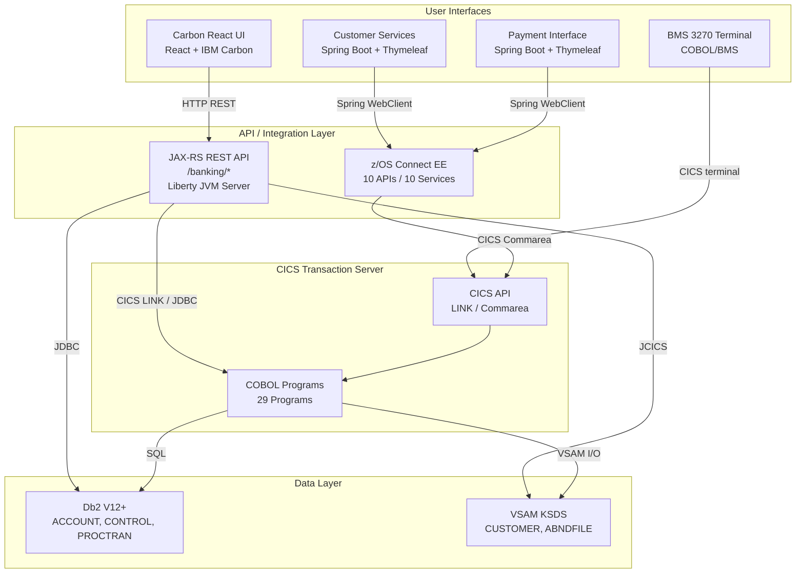
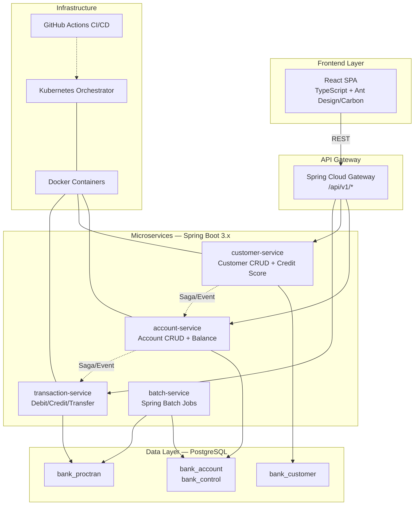
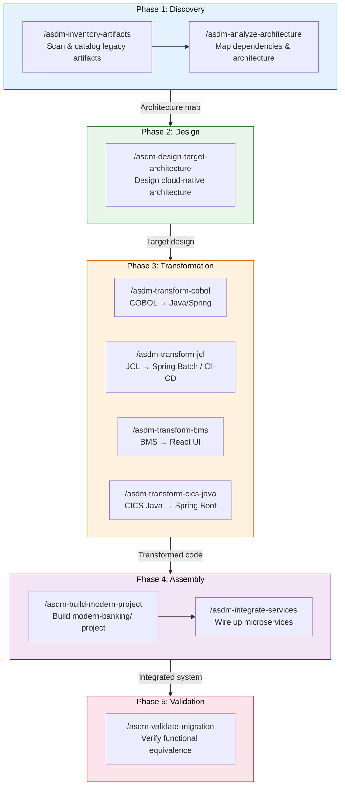

# Mainframe to x86 Linux Modern Architecture Migration Plan

## 1. Overview

This document defines the end-to-end migration plan for transforming the **CICS Banking Sample Application (CBSA)** from an IBM Mainframe (z/OS) architecture to a cloud-native x86 Linux modern architecture. The target output is placed in `modern-banking/`.

### Migration Scope

| Item | Source | Target |
|------|--------|--------|
| **Source Code** | `cics-banking-sample-application-cbsa/` | `modern-banking/` |
| **Toolset** | `.asdm/toolsets/mainframe-modernizer/` | Drives all phases |

### Business Domain

Banking / Financial Services — deposit, withdrawal, transfer, account/customer CRUD, transaction logging.

---

## 2. Original Architecture

The CBSA runs on IBM z/OS with CICS Transaction Server as the runtime, using a multi-layered architecture with 4 distinct user interfaces accessing shared COBOL business logic.



### Legacy Components Summary

| Layer | Component | Technology | Count | Description |
|-------|-----------|-----------|-------|-------------|
| **Core Logic** | COBOL Programs | COBOL | 29 | All banking business rules (CREACC, INQACC, DELACC, XFRFUN, etc.) |
| **Core Logic** | COBOL Copybooks | COBOL | 37 | Shared data structures (ACCOUNT.cpy, CUSTOMER.cpy, PROCTRAN.cpy, etc.) |
| **Terminal UI** | BMS Mapsets | BMS | 9 | 3270 terminal screens (BNK1MAI, BNK1CAM, BNK1TFM, etc.) |
| **REST API** | JAX-RS Resources | Java/Jakarta WS-RS | 6 | AccountsResource, CustomerResource, ProcessedTransactionResource, etc. |
| **Data Access** | JDBC DAO | Java | 2 | web.db2.Account, web.db2.ProcessedTransaction |
| **Data Access** | JCICS DAO | Java | 1 | web.vsam.Customer |
| **Data Access** | JZOS Interfaces | Java | 5 | CRECUST, CUSTOMER, PROCTRAN, NewAccountNumber, NewCustomerNumber |
| **Integration** | z/OS Connect APIs | Swagger 2.0 | 10 | creacc, crecust, inqaccz, inqacccz, inqcustz, delacc, delcus, updacc, updcust, makepayment |
| **Integration** | z/OS Connect Services | Service Archives | 11 | CSacccre, CScustcre, CSaccenq, CScustacc, CScustenq, CSaccdel, CScustdel, CSaccupd, CScustupd, Pay |
| **Web UI** | Customer Services | Spring Boot 3.5.11 + Thymeleaf | 1 | Port 19080, context /customerservices-1.0 |
| **Web UI** | Payment Interface | Spring Boot 3.5.11 + Thymeleaf | 1 | Port 19080, context /paymentinterface-1.1 |
| **Web UI** | Carbon React UI | React 18.2 + Carbon Design | 1 | SPA, deployed in webui WAR |
| **Database** | Db2 Tables | SQL | 3 | ACCOUNT, PROCTRAN, CONTROL |
| **Database** | VSAM KSDS | VSAM | 2 | CUSTOMER, ABNDFILE |
| **Batch** | JCL Scripts | JCL | 102 | Installation, compile, link-edit, Db2 setup |
| **Runtime** | CICS TS | z/OS | 1 | Transaction processing on z/OS LPAR |
| **Runtime** | Liberty JVM Server | Java 17 | 1 | CBSAWLP hosting all WAR modules |

---

## 3. Target Architecture

Cloud-native microservices on x86 Linux, containerized with Docker/Kubernetes, using Spring Boot 3.x for backend, React for frontend, and PostgreSQL for data.



### Target Project Structure

```
modern-banking/
├── README.md
├── docker-compose.yml                     ## Local dev environment (PG + all services)
├── pom.xml                                ## Maven parent POM (multi-module)
│
├── backend/                               ## Spring Boot backend services
│   ├── pom.xml                            ## Parent POM for services
│   ├── common/                            ## Shared library module
│   │   ├── pom.xml
│   │   └── src/main/java/com/banking/common/
│   │       ├── config/                    ## Shared configurations
│   │       ├── dto/                       ## Shared DTOs
│   │       ├── exception/                 ## Shared exception classes
│   │       └── util/                      ## Shared utilities
│   │
│   ├── account-service/                   ## Account management microservice
│   │   ├── pom.xml
│   │   ├── src/main/java/com/banking/account/
│   │   │   ├── AccountServiceApplication.java
│   │   │   ├── controller/               ## REST controllers
│   │   │   ├── service/                   ## Business logic (from COBOL CREACC/DELACC/INQACC/UPDACC)
│   │   │   ├── repository/               ## Spring Data JPA repositories
│   │   │   ├── model/                     ## JPA entities (from ACCOUNT.cpy)
│   │   │   ├── dto/                       ## Request/Response DTOs
│   │   │   ├── config/                    ## Service configuration
│   │   │   └── exception/                ## Service-specific exceptions
│   │   ├── src/main/resources/
│   │   │   ├── application.yml
│   │   │   └── db/migration/             ## Flyway migrations
│   │   └── src/test/java/
│   │
│   ├── customer-service/                  ## Customer management microservice
│   │   └── (same structure as account-service)
│   │
│   ├── transaction-service/               ## Transaction processing microservice
│   │   └── (same structure as account-service)
│   │
│   ├── batch-service/                     ## Spring Batch processing service
│   │   └── src/main/java/com/banking/batch/
│   │       ├── BatchServiceApplication.java
│   │       ├── job/                       ## Job configurations (from JCL)
│   │       ├── step/                      ## Step definitions
│   │       └── config/
│   │
│   └── api-gateway/                       ## API Gateway service
│       └── src/main/java/com/banking/gateway/
│           ├── GatewayApplication.java
│           └── config/
│
├── frontend/                              ## React frontend application
│   ├── package.json
│   ├── src/
│   │   ├── App.tsx
│   │   ├── pages/                         ## Page components (from BMS maps)
│   │   ├── components/                    ## Shared UI components
│   │   ├── services/                      ## API service modules
│   │   ├── hooks/                         ## Custom React hooks
│   │   ├── types/                         ## TypeScript type definitions
│   │   └── utils/                         ## Utility functions
│   └── public/
│
├── infrastructure/                        ## Deployment and infrastructure
│   ├── docker/                            ## Dockerfiles for each service
│   ├── k8s/                               ## Kubernetes manifests
│   └── ci-cd/                             ## CI/CD pipeline definitions
│
└── docs/                                  ## Documentation
    ├── architecture/                       ## Architecture decision records
    ├── api/                               ## OpenAPI specifications
    ├── migration/                         ## Migration mapping documents
    └── runbooks/                          ## Operational runbooks
```

---

## 4. Technology Replacement Matrix

| # | Original Technology (Mainframe/z/OS) | Replacement Technology (x86 Linux) | Category | Migration Rationale |
|---|--------------------------------------|-----------------------------------|----------|---------------------|
| 1 | **CICS Transaction Server V6.1+** | **Spring Boot 3.x** | Runtime | CICS transaction management → Spring Boot embedded Tomcat with declarative transactions |
| 2 | **COBOL Programs (29)** | **Java 17 / Spring Boot Services** | Business Logic | COBOL procedural code → object-oriented Java with Spring Service/Repository pattern |
| 3 | **COBOL Copybooks (37)** | **Java POJOs / JPA Entities / DTOs** | Data Structure | COBOL record layouts → Java classes with proper typing and validation |
| 4 | **BMS Mapsets (9)** | **React Pages/Components** | UI | 3270 terminal screens → modern web SPA pages |
| 5 | **Db2 V12+ on z/OS** | **PostgreSQL on Linux** | Database | Relational database migration; SQL dialect adjustments for PostgreSQL |
| 6 | **VSAM KSDS (CUSTOMER, ABNDFILE)** | **PostgreSQL Tables** | Database | VSAM key-sequenced files → relational tables with indexes; same key-based access pattern |
| 7 | **JCL Scripts (102)** | **Spring Batch + GitHub Actions** | Batch/CI | JCL job streams → Spring Batch jobs for business batch, GitHub Actions for CI/CD |
| 8 | **z/OS Connect EE** | **Spring Cloud Gateway + REST APIs** | Integration | REST-to-Commarea bridge → direct REST APIs with API Gateway routing |
| 9 | **Liberty JVM Server (CBSAWLP)** | **Docker Containers (Tomcat embedded)** | App Server | Shared JVM → isolated containers per service |
| 10 | **JAX-RS REST API (webui)** | **Spring Web MVC REST Controllers** | API | JAX-RS annotations → Spring MVC annotations (@RestController, @GetMapping, etc.) |
| 11 | **JCICS API (VSAM access)** | **Spring Data JPA** | Data Access | JCICS file control → JPA Repository abstraction over PostgreSQL |
| 12 | **JDBC with JNDI (Db2)** | **Spring Data JPA + HikariCP** | Data Access | JNDI datasource → Spring-managed datasource with connection pooling |
| 13 | **JZOS Record Generator** | **Jackson / MapStruct** | Data Mapping | COBOL binary data mapping → JSON serialization and DTO mapping |
| 14 | **CICS Commarea** | **JSON REST Request/Response** | Data Exchange | Binary commarea → JSON payloads over HTTP |
| 15 | **CICS LINK / START** | **REST API calls / Spring Events** | Inter-program Call | CICS inter-program communication → synchronous REST or async event-driven |
| 16 | **Spring Boot 3.5.11 + Thymeleaf (CS/Pay)** | **React SPA (unified frontend)** | Frontend | Server-rendered Thymeleaf → client-side React SPA |
| 17 | **React 18.2 + IBM Carbon Design** | **React + TypeScript + Ant Design/Carbon** | Frontend | Upgrade to TypeScript, modernize UI library |
| 18 | **z/OS LPAR** | **x86 Linux (Docker/K8s)** | Infrastructure | Mainframe hardware → commodity x86 Linux servers or cloud |
| 19 | **CICS Resources (PCT/PPT/FCT)** | **Kubernetes ConfigMaps/Secrets + Spring Config** | Configuration | CICS resource definitions → externalized Spring configuration |
| 20 | **IBM JZOS / CobolDatatypeFactory** | **Java records + Bean Validation** | Data Interface | COBOL data type mapping → native Java types with validation annotations |

---

## 5. Migration Steps

### Phase 1: Discovery — Inventory & Analysis

| Step | Action | Toolset Command | Input | Output | Key Tasks |
|------|--------|----------------|-------|--------|-----------|
| 1.1 | Inventory Artifacts | `/asdm-inventory-artifacts` | `cics-banking-sample-application-cbsa/` | Artifact catalog | Walk CBSA directory; classify 29 COBOL programs, 37 copybooks, 9 BMS maps, 82 Java files, 102 JCL scripts; extract metadata and build dependency graph |
| 1.2 | Analyze Architecture | `/asdm-analyze-architecture` | Artifact catalog + source code | Architecture map | Map COBOL program call chains (CREACC ← BNK1CAC, etc.); identify CICS resource references; trace data flow through ACCOUNT/PROCTRAN/CUSTOMER; document transaction boundaries |

### Phase 2: Design — Target Architecture

| Step | Action | Toolset Command | Input | Output | Key Tasks |
|------|--------|----------------|-------|--------|-----------|
| 2.1 | Design Target Architecture | `/asdm-design-target-architecture` | Architecture map | Target design + OpenAPI specs | Define 4 microservices (account, customer, transaction, batch) + API gateway; map 29 COBOL programs to service methods; design PostgreSQL schema from Db2+VSAM; produce OpenAPI 3.0 specs; define Saga patterns for cross-service operations (transfer) |

### Phase 3: Transformation — Code Conversion

| Step | Action | Toolset Command | Input | Output | Key Tasks |
|------|--------|----------------|-------|--------|-----------|
| 3.1 | Transform COBOL | `/asdm-transform-cobol` | COBOL programs + copybooks | Java/Spring service classes | Convert 29 COBOL programs to Java: CREACC→AccountService.createAccount(), INQACC→AccountService.getAccount(), XFRFUN→TransactionService.transfer(), etc.; preserve business logic and validation rules |
| 3.2 | Transform JCL | `/asdm-transform-jcl` | JCL scripts (102 files) | Spring Batch jobs + CI/CD pipelines | Convert Db2 installation JCL→Flyway migrations; compile JCL→Maven build; link-edit JCL→Docker build stages; batch processing JCL→Spring Batch job configurations |
| 3.3 | Transform BMS | `/asdm-transform-bms` | BMS mapsets (9 files) | React page components | BNK1MAI→HomePage, BNK1CAM→CreateAccountPage, BNK1CCM→CreateCustomerPage, BNK1TFM→TransferPage, etc.; map BMS fields to React form components |
| 3.4 | Transform CICS Java | `/asdm-transform-cics-java` | Java webui/CS/Payment sources | Spring Boot services | JAX-RS Resources→@RestController; JCICS VSAM access→JPA Repository; JZOS interfaces→DTO mappers; Thymeleaf controllers→removed (merged into React SPA) |

### Phase 4: Assembly — Build & Integrate

| Step | Action | Toolset Command | Input | Output | Key Tasks |
|------|--------|----------------|-------|--------|-----------|
| 4.1 | Build Modern Project | `/asdm-build-modern-project` | All transformed code | `modern-banking/` project | Create Maven multi-module project; set up account-service, customer-service, transaction-service, batch-service, api-gateway, common, frontend modules; configure docker-compose.yml with PostgreSQL + all services; write Dockerfiles |
| 4.2 | Integrate Services | `/asdm-integrate-services` | Assembled project | Integrated system | Configure API Gateway routing (/api/v1/accounts→account-service, etc.); implement Saga for transfer (debit + credit); set up Spring Kafka/RabbitMQ for async events; configure service discovery; add Spring Security + OAuth2 |

### Phase 5: Validation — Verify Equivalence

| Step | Action | Toolset Command | Input | Output | Key Tasks |
|------|--------|----------------|-------|--------|-----------|
| 5.1 | Validate Migration | `/asdm-validate-migration` | Legacy + Modern systems | Validation report | Compare API behavior: 10 z/OS Connect APIs vs new REST endpoints; verify data integrity: ACCOUNT/PROCTRAN/CUSTOMER records match; test transaction flows: create account, transfer funds, delete customer; verify batch job outputs; measure performance baseline |

---

## 6. Toolset Design & Usage Plan

The `mainframe-modernizer` toolset provides 10 actions paired with 10 specification documents. The following table maps each toolset action to its role in this migration, the spec that governs it, and the expected deliverable.

| Phase | Toolset Action | Spec | Deliverable | Description |
|-------|---------------|------|-------------|-------------|
| **1: Discovery** | `asdm-inventory-artifacts` | `inventory-spec` | `docs/migration/artifact-inventory.md` | Full catalog of 29 COBOL programs, 37 copybooks, 9 BMS maps, 82 Java files, 102 JCL scripts with classifications and dependency graph |
| **1: Discovery** | `asdm-analyze-architecture` | `architecture-analysis-spec` | `docs/migration/architecture-analysis.md` | Inter-program call map, CICS resource usage, data flow diagrams, transaction boundary identification |
| **2: Design** | `asdm-design-target-architecture` | `target-architecture-spec` | `docs/architecture/target-architecture.md` + OpenAPI specs | Service catalog (4 microservices), API contracts (OpenAPI 3.0), DB schema (PostgreSQL DDL), deployment topology |
| **3: Transform** | `asdm-list-tasks` | `task-execution-spec` | — | List migration tasks from WBS with status, priority, dependencies |
| **3: Transform** | `asdm-execute-task T{ID}` | `task-execution-spec` | `backend/*/` + `frontend/src/pages/` | Execute a migration task: COBOL → Service, JAX-RS → Controller, JCICS → JPA, BMS → React, JCL → Batch/Flyway |
| **4: Assembly** | `asdm-build-modern-project` | `project-structure-spec` | Complete `modern-banking/` project | Maven multi-module project, docker-compose.yml, Dockerfiles, application.yml configs |
| **4: Assembly** | `asdm-integrate-services` | `integration-spec` | Gateway config + event wiring | API Gateway routes, Saga orchestrator, Kafka/RabbitMQ topics, Spring Security config |
| **5: Validation** | `asdm-validate-migration` | `validation-spec` | `docs/migration/validation-report.md` | Functional equivalence test results, data integrity verification, performance comparison |

### Toolset Execution Order



### Key Transformation Mappings

#### COBOL Programs → Microservice Methods

| COBOL Program | Microservice | Java Method | REST Endpoint |
|---------------|-------------|-------------|---------------|
| CREACC | account-service | `AccountService.createAccount()` | `POST /api/v1/accounts` |
| INQACC | account-service | `AccountService.getAccount()` | `GET /api/v1/accounts/{id}` |
| INQACCCU | account-service | `AccountService.getAccountsByCustomer()` | `GET /api/v1/customers/{id}/accounts` |
| UPDACC | account-service | `AccountService.updateAccount()` | `PUT /api/v1/accounts/{id}` |
| DELACC | account-service | `AccountService.deleteAccount()` | `DELETE /api/v1/accounts/{id}` |
| CRECUST | customer-service | `CustomerService.createCustomer()` | `POST /api/v1/customers` |
| INQCUST | customer-service | `CustomerService.getCustomer()` | `GET /api/v1/customers/{id}` |
| UPDCUST | customer-service | `CustomerService.updateCustomer()` | `PUT /api/v1/customers/{id}` |
| DELCUS | customer-service | `CustomerService.deleteCustomer()` | `DELETE /api/v1/customers/{id}` |
| DBCRFUN | transaction-service | `TransactionService.debitCredit()` | `POST /api/v1/transactions/debit-credit` |
| XFRFUN | transaction-service | `TransactionService.transfer()` | `POST /api/v1/transactions/transfer` |
| CRDTAGY1-5 | customer-service | `CreditScoreService.calculateScore()` | `POST /api/v1/customers/{id}/credit-score` |
| GETCOMPY | account-service | `BankInfoService.getCompanyName()` | `GET /api/v1/bank/company-name` |
| GETSCODE | account-service | `BankInfoService.getSortCode()` | `GET /api/v1/bank/sort-code` |
| ABNDPROC | common | `ErrorHandler.handleAbend()` | Global `@ControllerAdvice` |
| BANKDATA | batch-service | `DataInitializerJob.initialize()` | Spring Batch job |
| BNK1CAC, BNK1CCA, BNK1CCS, BNK1CRA | (BMS) → React pages | N/A (UI controllers replaced by React) | N/A |
| BNK1DAC, BNK1DCS, BNK1TFN, BNK1UAC | (BMS) → React pages | N/A (UI controllers replaced by React) | N/A |
| BNKMENU | (BMS) → React pages | N/A (UI controllers replaced by React) | N/A |

#### BMS Mapsets → React Pages

| BMS Map | React Page Component | Route |
|---------|----------------------|-------|
| BNK1MAI (Main Menu) | `HomePage` | `/` |
| BNK1CAM (Create Account Menu) | `CreateAccountPage` | `/accounts/create` |
| BNK1CCM (Create Customer Menu) | `CreateCustomerPage` | `/customers/create` |
| BNK1DAM (Delete Account Menu) | `DeleteAccountPage` | `/accounts/delete` |
| BNK1DCM (Delete Customer Menu) | `DeleteCustomerPage` | `/customers/delete` |
| BNK1TFM (Transfer Funds Menu) | `TransferPage` | `/transactions/transfer` |
| BNK1UAM (Update Account Menu) | `UpdateAccountPage` | `/accounts/update` |
| BNK1ACC (Account Menu) | `AccountMenuPage` | `/accounts` |

#### Data Migration: Db2 + VSAM → PostgreSQL

| Original Storage | Table/File | PostgreSQL Table | Key Changes |
|-----------------|------------|-----------------|-------------|
| Db2 | ACCOUNT | `bank_account` | CHAR→VARCHAR; add auto-increment ID; add created_at/updated_at timestamps |
| Db2 | PROCTRAN | `bank_proctran` | Same type adjustments; add index on sortcode+number |
| Db2 | CONTROL | `bank_control` | Minimal changes; name as PK |
| VSAM KSDS | CUSTOMER | `bank_customer` | VSAM→relational; composite key (sortcode+customer_number) as PK; add indexes |
| VSAM KSDS | ABNDFILE | `abend_log` | VSAM→relational table for error logging |

---

## 7. Risk & Mitigation

| Risk | Impact | Mitigation |
|------|--------|------------|
| COBOL business logic misinterpretation | High — incorrect financial calculations | Validate each transformed program against original test cases; Phase 5 equivalence testing |
| VSAM access pattern not easily reproducible | Medium — performance degradation | PostgreSQL indexes on composite keys; benchmark key-based lookups |
| Cross-service transaction consistency (transfer) | High — data inconsistency | Saga pattern with compensating transactions; idempotent operations |
| Credit score logic (5 CRDTAGY programs) | Low — simulated external APIs | Implement as REST template to external service; keep mock as fallback |
| Loss of CICS-specific error handling (ABNDPROC) | Medium — error traceability | Implement global exception handler with structured error logging and alerting |

---

## 8. Success Criteria

1. All 29 COBOL business logic functions have equivalent Java implementations
2. All 10 z/OS Connect API operations have equivalent REST endpoints
3. All 9 BMS screens have equivalent React pages
4. Data migration from Db2 + VSAM to PostgreSQL is complete and verified
5. JCL batch processes are replaced by Spring Batch jobs
6. The system runs on x86 Linux with Docker/Kubernetes
7. Functional equivalence tests pass for all banking operations
8. `modern-banking/` project builds and runs end-to-end via `docker-compose up`

---

## Version History

| Version | Date | Change | Author |
|---------|------|--------|--------|
| 1.0.0 | 2026-04-15 | Initial migration plan | ASDM Planning |
