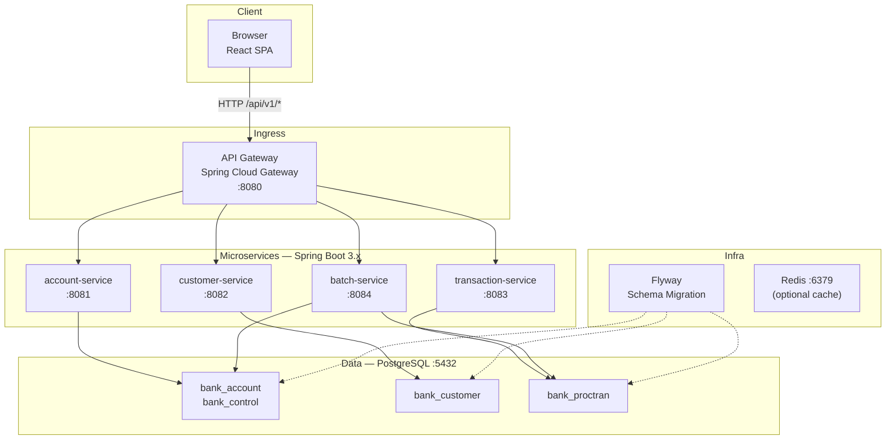
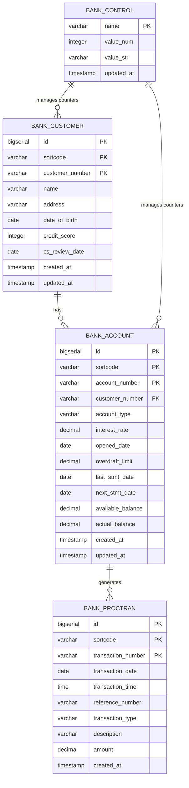

# Target Architecture — Modern Banking on x86 Linux

> This document is the authoritative reference for scaffolding `modern-banking/`. It specifies every directory, file, dependency version, port assignment, and placeholder code needed to build and run the project skeleton before the actual COBOL/Java migration begins.

---

## Spec Constraints & Compliance

This document is governed by the `mainframe-modernizer` toolset specifications. Every design decision, code pattern, and structural choice in this architecture document must comply with the constraints defined in the following spec files. Violations of any spec constraint are blocking issues for the scaffolding process.

### Spec Registry

| # | Spec | Path | Governs | Key Constraints Enforced in This Document |
|---|------|------|---------|------------------------------------------|
| 1 | **Inventory Spec** | [`specs/inventory-spec.md`](../../toolsets/mainframe-modernizer/specs/inventory-spec.md) | Artifact classification & catalog | All legacy artifacts (29 COBOL, 37 copybooks, 9 BMS, 82 Java, 102 JCL) must be accounted for in service API endpoint mappings (§3 Service Catalog) |
| 2 | **Architecture Analysis Spec** | [`specs/architecture-analysis-spec.md`](../../toolsets/mainframe-modernizer/specs/architecture-analysis-spec.md) | Call graph & data flow mapping | Service boundaries must reflect program call chains (CICS LINK/XCTL → REST calls); circular dependencies flagged; COBOL data structure sharing maps to common DTOs (§3, §7) |
| 3 | **Target Architecture Spec** | [`specs/target-architecture-spec.md`](../../toolsets/mainframe-modernizer/specs/target-architecture-spec.md) | Cloud-native architecture design | **5 Architecture Principles** (§1); database-per-service (§4.3); OpenAPI 3.0 documentation (§6.11); Saga for cross-service consistency (§3.4) |
| 4 | **Task Execution Spec** | [`specs/task-execution-spec.md`](../../toolsets/mainframe-modernizer/specs/task-execution-spec.md) | Task-driven migration execution | Transformation rules for all legacy layers: COBOL data structure mapping (PIC X → String, PIC 9 → Integer, PIC 9V9 → BigDecimal, REDEFINES → @Transient, OCCURS → List<T>); BMS screen mapping (mapset → React page, ATTRB=UNPROT → editable, ATTRB=PROT → read-only, PF3 → back, PF5 → submit); CICS Java mapping (JCICS LINK → RestTemplate/FeignClient, File.read/write → JpaRepository, COMMAREA → @RequestBody DTO); JCL mapping (JOB → Spring Batch Job, STEP → Step, DDL → Flyway) |
| 5 | **Project Structure Spec** | [`specs/project-structure-spec.md`](../../toolsets/mainframe-modernizer/specs/project-structure-spec.md) | Directory structure & naming | **Directory layout** (§6) must match exactly; naming conventions (§11) enforced; each service independently buildable; shared code in `common` only; all config externalized; no cross-service schema access |
| 6 | **Integration Spec** | [`specs/integration-spec.md`](../../toolsets/mainframe-modernizer/specs/integration-spec.md) | Service integration patterns | All external requests through API Gateway (§3.1); path-based routing `/api/v1/{service}/**`; no sync call chains >3 deep; 30s timeout standard, 60s batch; circuit breaker 50% failure in 10s; database-per-service; Saga for cross-service transactions; health check at `/actuator/health` |
| 7 | **Validation Spec** | [`specs/validation-spec.md`](../../toolsets/mainframe-modernizer/specs/validation-spec.md) | Migration equivalence testing | Every legacy CICS transaction must have a corresponding modern API endpoint (§3); numeric precision preserved (BigDecimal); EBCDIC→UTF-8 documented; 80%+ test coverage target; performance regression flag if >2x legacy response time |

### Compliance Verification

Before the scaffolding is considered complete, the following compliance checks must pass:

| Check | Spec Reference | Verification Method |
|-------|---------------|-------------------|
| All 29 COBOL programs have a corresponding Java service method | Task Execution Spec §Transformation Rules | Count `@Service` methods vs COBOL program list |
| All 10 z/OS Connect API operations have REST endpoint equivalents | Target Architecture §API Contract Rules | Compare OpenAPI spec with z/OS Connect service list |
| All 9 BMS mapsets have React page equivalents | Task Execution Spec §Transformation Rules | Compare frontend pages with BMS map list |
| Database-per-service pattern is enforced | Integration Spec §Data Consistency | Verify no cross-service JPA repository access |
| Each service is independently buildable | Project Structure Spec §Constraints | `mvn package -pl backend/account-service` succeeds |
| All configuration is externalized | Project Structure Spec §Constraints | No hardcoded values in Java code; all via `application.yml` or env vars |
| JPA entities use `BigDecimal` for monetary fields | Task Execution Spec §Transformation Rules | Static analysis: no `double`/`float` for money |
| API Gateway routes all external requests | Integration Spec §API Gateway | No direct service port exposure in production config |
| Flyway manages all schema — `ddl-auto=validate` | Target Architecture §Data Model Rules | Check `application.yml` per service |
| Placeholder code compiles and runs | Project Structure Spec §Constraints | `mvn clean package` + `docker-compose up` succeed |

---

## 1. Architecture Overview

The target system is a **cloud-native microservices architecture** running on x86 Linux, containerized with Docker, and orchestrated by Kubernetes in production. It replaces the monolithic CICS/COBOL/Db2/VSAM stack with Spring Boot services, PostgreSQL, and a React SPA.



### Architecture Principles

> **Spec compliance**: These principles are mandated by [Target Architecture Spec §Architecture Principles](../../toolsets/mainframe-modernizer/specs/target-architecture-spec.md).

| # | Principle | Spec Source | Enforcement in This Architecture |
|---|-----------|------------|----------------------------------|
| 1 | **Service Autonomy** | target-architecture-spec §1 | Each service owns its database schema; no cross-service DB access (§4.3) |
| 2 | **API-First** | target-architecture-spec §2 | All interactions through REST APIs documented with OpenAPI 3.0 (§6.11) |
| 3 | **Stateless Services** | target-architecture-spec §3 | State in PostgreSQL/Redis only; services horizontally scalable |
| 4 | **Domain-Driven Design** | target-architecture-spec §4 | Service boundaries: Account, Customer, Transaction, Batch — aligned with bounded contexts from [architecture-analysis-spec §business_functions](../../toolsets/mainframe-modernizer/specs/architecture-analysis-spec.md) |
| 5 | **Cloud-Native** | target-architecture-spec §5 | 12-factor app config; Docker/K8s deployment; health probes at `/actuator/health` per [integration-spec §Service Discovery](../../toolsets/mainframe-modernizer/specs/integration-spec.md) |

---

## 2. Technology Stack (Exact Versions)

### Backend

| Layer | Technology | Version | Purpose |
|-------|-----------|---------|---------|
| **Runtime** | Java | 17 (LTS) | Language runtime |
| **Framework** | Spring Boot | 3.3.6 | Application framework |
| **Web** | Spring Web MVC | 6.1.x | REST controllers |
| **Data** | Spring Data JPA | 3.3.x | Repository abstraction |
| **Database** | PostgreSQL | 16 | Primary data store |
| **Connection Pool** | HikariCP | 5.1.x | JDBC connection pooling |
| **Migration** | Flyway | 10.x | Database schema versioning |
| **Gateway** | Spring Cloud Gateway | 4.1.x | API routing & filtering |
| **Batch** | Spring Batch | 5.1.x | Batch job processing |
| **Validation** | Bean Validation | 3.0.x (Hibernate Validator 8.x) | Request/entity validation |
| **Mapping** | MapStruct | 1.6.x | DTO ↔ Entity mapping |
| **Docs** | SpringDoc OpenAPI | 2.6.x | OpenAPI 3.0 generation |
| **Monitoring** | Spring Actuator | 3.3.x | Health/metrics endpoints |
| **Resilience** | Resilience4j | 2.2.x | Circuit breaker, retry |
| **Build** | Maven | 3.9.x | Build & dependency management |

### Frontend

| Layer | Technology | Version | Purpose |
|-------|-----------|---------|---------|
| **Runtime** | Node.js | 20 LTS | JavaScript runtime |
| **Framework** | React | 18.3.x | UI library |
| **Language** | TypeScript | 5.x | Type-safe JavaScript |
| **Routing** | react-router-dom | 6.x | Client-side routing |
| **HTTP** | axios | 1.7.x | API client |
| **UI Library** | Ant Design | 5.x | Component library |
| **Build** | Vite | 5.x | Build tool & dev server |

### Infrastructure

| Layer | Technology | Version | Purpose |
|-------|-----------|---------|---------|
| **Container** | Docker | 24+ | Containerization |
| **Orchestration** | Kubernetes | 1.28+ | Container orchestration |
| **CI/CD** | GitHub Actions | N/A | Build/test/deploy pipelines |
| **Cache** | Redis | 7.x | Optional caching layer |

---

## 3. Service Catalog

### 3.1 API Gateway

> **Spec compliance**: [Integration Spec §API Gateway Configuration](../../toolsets/mainframe-modernizer/specs/integration-spec.md) — "All external requests enter through the API Gateway; path-based routing: `/api/v1/{service}/**` → `{service}-service`".

| Property | Value |
|----------|-------|
| **Module** | `backend/api-gateway` |
| **Package** | `com.banking.gateway` |
| **Port** | 8080 |
| **Main Class** | `GatewayApplication` |
| **Dependencies** | Spring Cloud Gateway, Spring Actuator |

**Routing Rules:**

| Route | Target Service | Backend Path |
|-------|---------------|-------------|
| `/api/v1/accounts/**` | account-service:8081 | `/api/v1/accounts/**` |
| `/api/v1/customers/**` | customer-service:8082 | `/api/v1/customers/**` |
| `/api/v1/transactions/**` | transaction-service:8083 | `/api/v1/transactions/**` |
| `/api/v1/batch/**` | batch-service:8084 | `/api/v1/batch/**` |
| `/api/v1/bank/**` | account-service:8081 | `/api/v1/bank/**` |

### 3.2 Account Service

| Property | Value |
|----------|-------|
| **Module** | `backend/account-service` |
| **Package** | `com.banking.account` |
| **Port** | 8081 |
| **Main Class** | `AccountServiceApplication` |
| **Database** | PostgreSQL → schemas: `bank_account`, `bank_control` |
| **Legacy Origin** | COBOL: CREACC, INQACC, INQACCCU, UPDACC, DELACC, GETCOMPY, GETSCODE; Java: AccountsResource, web.db2.Account |

**API Endpoints:**

| Method | Path | Description | Legacy Source |
|--------|------|-------------|---------------|
| GET | `/api/v1/accounts` | List all accounts | AccountsResource.getAccounts() |
| GET | `/api/v1/accounts/{sortcode}/{number}` | Get account by key | INQACC |
| GET | `/api/v1/customers/{customerNumber}/accounts` | List accounts by customer | INQACCCU |
| POST | `/api/v1/accounts` | Create account | CREACC |
| PUT | `/api/v1/accounts/{sortcode}/{number}` | Update account | UPDACC |
| DELETE | `/api/v1/accounts/{sortcode}/{number}` | Delete account | DELACC |
| GET | `/api/v1/bank/company-name` | Get company name | GETCOMPY |
| GET | `/api/v1/bank/sort-code` | Get sort code | GETSCODE |

**JPA Entities:** `BankAccount`, `BankControl`

### 3.3 Customer Service

| Property | Value |
|----------|-------|
| **Module** | `backend/customer-service` |
| **Package** | `com.banking.customer` |
| **Port** | 8082 |
| **Main Class** | `CustomerServiceApplication` |
| **Database** | PostgreSQL → schema: `bank_customer` |
| **Legacy Origin** | COBOL: CRECUST, INQCUST, UPDCUST, DELCUS, CRDTAGY1-5; Java: CustomerResource, web.vsam.Customer |

**API Endpoints:**

| Method | Path | Description | Legacy Source |
|--------|------|-------------|---------------|
| GET | `/api/v1/customers` | List all customers | CustomerResource.getCustomers() |
| GET | `/api/v1/customers/{sortcode}/{number}` | Get customer by key | INQCUST |
| POST | `/api/v1/customers` | Create customer | CRECUST |
| PUT | `/api/v1/customers/{sortcode}/{number}` | Update customer | UPDCUST |
| DELETE | `/api/v1/customers/{sortcode}/{number}` | Delete customer | DELCUS |
| POST | `/api/v1/customers/{sortcode}/{number}/credit-score` | Calculate credit score | CRDTAGY1-5 |

**JPA Entities:** `BankCustomer`

### 3.4 Transaction Service

| Property | Value |
|----------|-------|
| **Module** | `backend/transaction-service` |
| **Package** | `com.banking.transaction` |
| **Port** | 8083 |
| **Main Class** | `TransactionServiceApplication` |
| **Database** | PostgreSQL → schema: `bank_proctran` |
| **Legacy Origin** | COBOL: DBCRFUN, XFRFUN; Java: ProcessedTransactionResource, AccountsResource (debit/credit/transfer) |

**API Endpoints:**

| Method | Path | Description | Legacy Source |
|--------|------|-------------|---------------|
| GET | `/api/v1/transactions` | List transactions | ProcessedTransactionResource |
| GET | `/api/v1/transactions/{sortcode}/{number}` | Get transaction by key | PROCTRAN query |
| POST | `/api/v1/transactions/debit-credit` | Debit or credit account | DBCRFUN |
| POST | `/api/v1/transactions/transfer` | Transfer between accounts | XFRFUN |

**JPA Entities:** `BankProctran`

### 3.5 Batch Service

> **Spec compliance**: [Task Execution Spec §Transformation Rules](../../toolsets/mainframe-modernizer/specs/task-execution-spec.md) — "JCL JOB → Spring Batch `Job`; EXEC STEP → Spring Batch `Step`".

| Property | Value |
|----------|-------|
| **Module** | `backend/batch-service` |
| **Package** | `com.banking.batch` |
| **Port** | 8084 |
| **Main Class** | `BatchServiceApplication` |
| **Database** | PostgreSQL → accesses `bank_account`, `bank_proctran` (read-only via REST APIs in production) |
| **Legacy Origin** | COBOL: BANKDATA; JCL installation scripts |

**Batch Jobs:**

| Job | Description | Legacy Source |
|-----|-------------|---------------|
| `dataInitializerJob` | Initialize sample banking data | BANKDATA + JCL install scripts |
| `endOfDayJob` | End-of-day balance processing | (Placeholder for future) |

### 3.6 Common Library

| Property | Value |
|----------|-------|
| **Module** | `backend/common` |
| **Package** | `com.banking.common` |
| **Type** | Shared JAR (not a runnable service) |
| **Purpose** | Shared DTOs, exceptions, utilities used by all services |

**Shared Classes:**

| Package | Classes | Description |
|---------|---------|-------------|
| `com.banking.common.dto` | `ApiResponse<T>`, `PagedResponse<T>`, `ErrorResponse` | Standard response wrappers |
| `com.banking.common.exception` | `ResourceNotFoundException`, `BusinessException`, `GlobalExceptionHandler` | Common exception hierarchy |
| `com.banking.common.util` | `SortCodeUtil`, `AccountNumberUtil` | Business key format utilities |

---

## 4. Database Schema Design

### 4.1 ER Diagram



### 4.2 Table DDL (PostgreSQL)

<details>
<summary>bank_account</summary>

```sql
CREATE TABLE bank_account (
    id              BIGSERIAL       PRIMARY KEY,
    sortcode        VARCHAR(6)      NOT NULL,
    account_number  VARCHAR(8)      NOT NULL,
    customer_number VARCHAR(10)     NOT NULL,
    account_type    VARCHAR(8)      NOT NULL,
    interest_rate   DECIMAL(6,2)    NOT NULL DEFAULT 0.00,
    opened_date     DATE            NOT NULL,
    overdraft_limit DECIMAL(12,2)   NOT NULL DEFAULT 0.00,
    last_stmt_date  DATE,
    next_stmt_date  DATE,
    available_balance DECIMAL(12,2) NOT NULL DEFAULT 0.00,
    actual_balance  DECIMAL(12,2)   NOT NULL DEFAULT 0.00,
    created_at      TIMESTAMP       NOT NULL DEFAULT NOW(),
    updated_at      TIMESTAMP       NOT NULL DEFAULT NOW(),
    CONSTRAINT uk_account_key UNIQUE (sortcode, account_number)
);

CREATE INDEX idx_account_customer ON bank_account (customer_number);
```

</details>

<details>
<summary>bank_customer</summary>

```sql
CREATE TABLE bank_customer (
    id              BIGSERIAL       PRIMARY KEY,
    sortcode        VARCHAR(6)      NOT NULL,
    customer_number VARCHAR(10)     NOT NULL,
    name            VARCHAR(60)     NOT NULL,
    address         VARCHAR(160),
    date_of_birth   DATE,
    credit_score    INTEGER         DEFAULT 0,
    cs_review_date  DATE,
    created_at      TIMESTAMP       NOT NULL DEFAULT NOW(),
    updated_at      TIMESTAMP       NOT NULL DEFAULT NOW(),
    CONSTRAINT uk_customer_key UNIQUE (sortcode, customer_number)
);
```

</details>

<details>
<summary>bank_proctran</summary>

```sql
CREATE TABLE bank_proctran (
    id                  BIGSERIAL       PRIMARY KEY,
    sortcode            VARCHAR(6)      NOT NULL,
    transaction_number  VARCHAR(8)      NOT NULL,
    transaction_date    DATE            NOT NULL,
    transaction_time    TIME            NOT NULL,
    reference_number    VARCHAR(12),
    transaction_type    VARCHAR(3)      NOT NULL,
    description         VARCHAR(40),
    amount              DECIMAL(12,2)   NOT NULL DEFAULT 0.00,
    created_at          TIMESTAMP       NOT NULL DEFAULT NOW(),
    CONSTRAINT uk_proctran_key UNIQUE (sortcode, transaction_number)
);
```

</details>

<details>
<summary>bank_control</summary>

```sql
CREATE TABLE bank_control (
    name        VARCHAR(32)     PRIMARY KEY,
    value_num   INTEGER         DEFAULT 0,
    value_str   VARCHAR(40),
    updated_at  TIMESTAMP       NOT NULL DEFAULT NOW()
);
```

</details>

### 4.3 Schema-to-Service Ownership

> **Spec compliance**: [Target Architecture Spec §Data Model Rules](../../toolsets/mainframe-modernizer/specs/target-architecture-spec.md) — "Each service owns its database schema (database-per-service pattern)". [Integration Spec §Data Consistency](../../toolsets/mainframe-modernizer/specs/integration-spec.md) — "Database-per-service pattern — no shared databases".

| Table | Owning Service | Migration Module |
|-------|---------------|-----------------|
| `bank_account` | account-service | `account-service/src/main/resources/db/migration/` |
| `bank_control` | account-service | `account-service/src/main/resources/db/migration/` |
| `bank_customer` | customer-service | `customer-service/src/main/resources/db/migration/` |
| `bank_proctran` | transaction-service | `transaction-service/src/main/resources/db/migration/` |

**Constraint**: No service may directly access another service's database tables. Cross-service data access must go through REST APIs. The batch-service, which needs account and transaction data, must call `account-service` and `transaction-service` APIs rather than querying their databases directly.

---

## 5. Port & URL Mapping

### Service Ports

| Service | Port | Context Path | Actuator |
|---------|------|-------------|----------|
| api-gateway | 8080 | `/` | `/actuator/health` |
| account-service | 8081 | `/` | `/actuator/health` |
| customer-service | 8082 | `/` | `/actuator/health` |
| transaction-service | 8083 | `/` | `/actuator/health` |
| batch-service | 8084 | `/` | `/actuator/health` |
| PostgreSQL | 5432 | N/A | N/A |
| Redis | 6379 | N/A | N/A |

### Frontend Development

| Environment | API Base URL |
|-------------|-------------|
| Local dev (Vite proxy) | `http://localhost:8080/api/v1` |
| Docker Compose | `http://api-gateway:8080/api/v1` |
| Production (K8s Ingress) | `https://banking.example.com/api/v1` |

---

## 6. Complete File Listing with Placeholder Code

> **Spec compliance**: [Project Structure Spec](../../toolsets/mainframe-modernizer/specs/project-structure-spec.md) — directory layout, naming conventions, and structural constraints must be followed exactly. [Project Structure Spec §Constraints](../../toolsets/mainframe-modernizer/specs/project-structure-spec.md) — "Each microservice must be independently buildable and deployable; shared code belongs in the `common` module; all configuration must be externalized; database schemas are owned by their respective services".

Each file below is required for the project to **compile and run**. Placeholder implementations are marked with `// TODO: migrate from <legacy-source>`.

### 6.1 Root Files

```
modern-banking/
├── README.md
├── docker-compose.yml
├── pom.xml
├── .gitignore
```

### 6.2 Backend Root

```
modern-banking/backend/
├── pom.xml
```

### 6.3 Common Module

```
modern-banking/backend/common/
├── pom.xml
├── src/main/java/com/banking/common/
│   ├── CommonAutoConfiguration.java
│   ├── dto/
│   │   ├── ApiResponse.java
│   │   ├── PagedResponse.java
│   │   └── ErrorResponse.java
│   ├── exception/
│   │   ├── ResourceNotFoundException.java
│   │   ├── BusinessException.java
│   │   └── GlobalExceptionHandler.java
│   └── util/
│       └── BankingKeyUtil.java
└── src/test/java/com/banking/common/
    └── util/
        └── BankingKeyUtilTest.java
```

### 6.4 Account Service

```
modern-banking/backend/account-service/
├── pom.xml
├── src/main/java/com/banking/account/
│   ├── AccountServiceApplication.java
│   ├── controller/
│   │   ├── AccountController.java
│   │   └── BankInfoController.java
│   ├── service/
│   │   ├── AccountService.java
│   │   └── BankInfoService.java
│   ├── repository/
│   │   ├── AccountRepository.java
│   │   └── ControlRepository.java
│   ├── model/
│   │   ├── BankAccount.java
│   │   └── BankControl.java
│   ├── dto/
│   │   ├── AccountCreateRequest.java
│   │   ├── AccountUpdateRequest.java
│   │   └── AccountResponse.java
│   ├── config/
│   │   └── ServiceConfig.java
│   └── exception/
│       └── AccountNotFoundException.java
├── src/main/resources/
│   ├── application.yml
│   └── db/migration/
│       ├── V1__Create_bank_account_table.sql
│       └── V2__Create_bank_control_table.sql
└── src/test/java/com/banking/account/
    ├── AccountServiceApplicationTest.java
    └── controller/
        └── AccountControllerTest.java
```

### 6.5 Customer Service

```
modern-banking/backend/customer-service/
├── pom.xml
├── src/main/java/com/banking/customer/
│   ├── CustomerServiceApplication.java
│   ├── controller/
│   │   └── CustomerController.java
│   ├── service/
│   │   ├── CustomerService.java
│   │   └── CreditScoreService.java
│   ├── repository/
│   │   └── CustomerRepository.java
│   ├── model/
│   │   └── BankCustomer.java
│   ├── dto/
│   │   ├── CustomerCreateRequest.java
│   │   ├── CustomerUpdateRequest.java
│   │   └── CustomerResponse.java
│   ├── config/
│   │   └── ServiceConfig.java
│   └── exception/
│       └── CustomerNotFoundException.java
├── src/main/resources/
│   ├── application.yml
│   └── db/migration/
│       └── V1__Create_bank_customer_table.sql
└── src/test/java/com/banking/customer/
    ├── CustomerServiceApplicationTest.java
    └── controller/
        └── CustomerControllerTest.java
```

### 6.6 Transaction Service

```
modern-banking/backend/transaction-service/
├── pom.xml
├── src/main/java/com/banking/transaction/
│   ├── TransactionServiceApplication.java
│   ├── controller/
│   │   └── TransactionController.java
│   ├── service/
│   │   └── TransactionService.java
│   ├── repository/
│   │   └── ProctranRepository.java
│   ├── model/
│   │   └── BankProctran.java
│   ├── dto/
│   │   ├── DebitCreditRequest.java
│   │   ├── TransferRequest.java
│   │   └── TransactionResponse.java
│   ├── config/
│   │   └── ServiceConfig.java
│   └── exception/
│       └── TransactionException.java
├── src/main/resources/
│   ├── application.yml
│   └── db/migration/
│       └── V1__Create_bank_proctran_table.sql
└── src/test/java/com/banking/transaction/
    ├── TransactionServiceApplicationTest.java
    └── controller/
        └── TransactionControllerTest.java
```

### 6.7 Batch Service

```
modern-banking/backend/batch-service/
├── pom.xml
├── src/main/java/com/banking/batch/
│   ├── BatchServiceApplication.java
│   ├── job/
│   │   └── DataInitializerJobConfig.java
│   ├── step/
│   │   └── DataInitializerStepConfig.java
│   └── config/
│       └── BatchConfig.java
├── src/main/resources/
│   ├── application.yml
│   └── data/
│       └── sample-data.csv
└── src/test/java/com/banking/batch/
    └── BatchServiceApplicationTest.java
```

### 6.8 API Gateway

```
modern-banking/backend/api-gateway/
├── pom.xml
├── src/main/java/com/banking/gateway/
│   ├── GatewayApplication.java
│   └── config/
│       └── RouteConfig.java
└── src/main/resources/
    └── application.yml
```

### 6.9 Frontend

```
modern-banking/frontend/
├── package.json
├── tsconfig.json
├── vite.config.ts
├── index.html
├── public/
│   └── favicon.ico
└── src/
    ├── main.tsx
    ├── App.tsx
    ├── vite-env.d.ts
    ├── types/
    │   └── index.ts
    ├── services/
    │   ├── api.ts
    │   ├── accountService.ts
    │   ├── customerService.ts
    │   └── transactionService.ts
    ├── pages/
    │   ├── HomePage.tsx
    │   ├── AccountMenuPage.tsx
    │   ├── CreateAccountPage.tsx
    │   ├── UpdateAccountPage.tsx
    │   ├── DeleteAccountPage.tsx
    │   ├── CreateCustomerPage.tsx
    │   ├── DeleteCustomerPage.tsx
    │   └── TransferPage.tsx
    ├── components/
    │   └── Layout.tsx
    └── utils/
        └── format.ts
```

### 6.10 Infrastructure

```
modern-banking/infrastructure/
├── docker/
│   ├── account-service.Dockerfile
│   ├── customer-service.Dockerfile
│   ├── transaction-service.Dockerfile
│   ├── batch-service.Dockerfile
│   ├── api-gateway.Dockerfile
│   └── frontend.Dockerfile
├── k8s/
│   ├── namespace.yaml
│   ├── deployments/
│   │   ├── account-service.yaml
│   │   ├── customer-service.yaml
│   │   ├── transaction-service.yaml
│   │   ├── batch-service.yaml
│   │   └── api-gateway.yaml
│   ├── services/
│   │   ├── account-service.yaml
│   │   ├── customer-service.yaml
│   │   ├── transaction-service.yaml
│   │   ├── batch-service.yaml
│   │   └── api-gateway.yaml
│   ├── configmaps/
│   │   └── banking-config.yaml
│   └── ingress.yaml
└── ci-cd/
    └── github-actions/
        ├── build.yml
        └── deploy.yml
```

### 6.11 Documentation

```
modern-banking/docs/
├── architecture/
│   └── ADR-001-microservices-boundaries.md
├── api/
│   ├── account-service-openapi.yaml
│   ├── customer-service-openapi.yaml
│   └── transaction-service-openapi.yaml
├── migration/
│   └── README.md
└── runbooks/
    └── local-development.md
```

---

## 7. Placeholder Code Specifications

> **Spec compliance**: Placeholder code must follow the transformation rules defined in [Task Execution Spec](../../toolsets/mainframe-modernizer/specs/task-execution-spec.md). Even in placeholder stage, the structural patterns (entity field types, controller structure, page mapping) must match the spec-defined transformation rules so that actual migration code can be plugged in without restructuring.

Each placeholder class must compile and be functional enough to return stub data. The following defines the minimum viable placeholder for each critical file.

### 7.1 Common Module — Key Shared Classes

**`ApiResponse<T>`** — Standard response wrapper:
```java
public class ApiResponse<T> {
    private boolean success;
    private T data;
    private String message;
    // constructors, getters, setters
}
```

**`GlobalExceptionHandler`** — Catches all unhandled exceptions:
```java
@RestControllerAdvice
public class GlobalExceptionHandler {
    @ExceptionHandler(ResourceNotFoundException.class)
    public ResponseEntity<ErrorResponse> handleNotFound(ResourceNotFoundException ex) { ... }
    @ExceptionHandler(BusinessException.class)
    public ResponseEntity<ErrorResponse> handleBusiness(BusinessException ex) { ... }
    @ExceptionHandler(Exception.class)
    public ResponseEntity<ErrorResponse> handleGeneral(Exception ex) { ... }
}
```

### 7.2 Service Application Classes (Pattern)

Each service main class follows this pattern:
```java
@SpringBootApplication
public class AccountServiceApplication {
    public static void main(String[] args) {
        SpringApplication.run(AccountServiceApplication.class, args);
    }
}
```

### 7.3 Controller Pattern (Placeholder)

> **Spec compliance**: [Task Execution Spec §Transformation Rules](../../toolsets/mainframe-modernizer/specs/task-execution-spec.md) — `CICSProgram` → `@RestController`; `COMMAREA` → `@RequestBody` DTO; [Target Architecture Spec §API Contract Rules](../../toolsets/mainframe-modernizer/specs/target-architecture-spec.md) — "HTTP methods follow REST conventions; error responses use standard HTTP status codes with structured error bodies".

Each controller returns stub data with `// TODO` markers:
```java
@RestController
@RequestMapping("/api/v1/accounts")
public class AccountController {

    @GetMapping
    public ResponseEntity<ApiResponse<List<AccountResponse>>> listAccounts() {
        // TODO: migrate from AccountsResource.getAccounts() — JAX-RS → Spring MVC
        return ResponseEntity.ok(ApiResponse.success(Collections.emptyList(), "Accounts listed (placeholder)"));
    }

    @GetMapping("/{sortcode}/{number}")
    public ResponseEntity<ApiResponse<AccountResponse>> getAccount(
            @PathVariable String sortcode, @PathVariable String number) {
        // TODO: migrate from COBOL INQACC — account inquiry logic
        throw new ResourceNotFoundException("Account", sortcode + "/" + number);
    }

    @PostMapping
    public ResponseEntity<ApiResponse<AccountResponse>> createAccount(
            @Valid @RequestBody AccountCreateRequest request) {
        // TODO: migrate from COBOL CREACC — create account logic
        return ResponseEntity.ok(ApiResponse.success(new AccountResponse(), "Account created (placeholder)"));
    }
    // ... PUT, DELETE follow same pattern
}
```

### 7.4 JPA Entity Pattern (Placeholder)

> **Spec compliance**: [Task Execution Spec §Transformation Rules](../../toolsets/mainframe-modernizer/specs/task-execution-spec.md) — `PIC X(n)` → `String`, `PIC 9(n)V9(m)` → `BigDecimal`. All numeric precision must be maintained (use `BigDecimal` for decimal fields).

```java
@Entity
@Table(name = "bank_account", uniqueConstraints = {
    @UniqueConstraint(columnNames = {"sortcode", "account_number"})
})
public class BankAccount {
    @Id
    @GeneratedValue(strategy = GenerationType.IDENTITY)
    private Long id;

    @Column(nullable = false, length = 6)
    private String sortcode;

    @Column(nullable = false, length = 8)
    private String accountNumber;

    // TODO: migrate remaining fields from ACCOUNT.cpy
    @Column(length = 10, nullable = false)
    private String customerNumber;

    @Column(length = 8, nullable = false)
    private String accountType;

    // ... getters, setters
}
```

### 7.5 Repository Pattern (Placeholder)

```java
@Repository
public interface AccountRepository extends JpaRepository<BankAccount, Long> {
    Optional<BankAccount> findBySortcodeAndAccountNumber(String sortcode, String accountNumber);
    List<BankAccount> findByCustomerNumber(String customerNumber);
}
```

### 7.6 Frontend Page Pattern (Placeholder)

> **Spec compliance**: [Task Execution Spec §Transformation Rules](../../toolsets/mainframe-modernizer/specs/task-execution-spec.md) — "Each BMS mapset generates one React page component"; PF3 → back button, PF5 → submit button.

```tsx
export const CreateAccountPage: React.FC = () => {
  // TODO: migrate from BMS BNK1CAM — create account screen
  return (
    <div className="page-container">
      <h1>Create Account</h1>
      <p>Placeholder — will be migrated from BMS BNK1CAM mapset</p>
    </div>
  );
};
```

### 7.7 API Service Pattern (Frontend)

```typescript
const API_BASE = '/api/v1';

export const accountService = {
  list: () => axios.get(`${API_BASE}/accounts`),
  get: (sortcode: string, number: string) =>
    axios.get(`${API_BASE}/accounts/${sortcode}/${number}`),
  create: (data: AccountCreateRequest) =>
    axios.post(`${API_BASE}/accounts`, data),
  // TODO: migrate from React Carbon UI axios calls
};
```

---

## 8. Maven POM Structure

### 8.1 Parent POM (`modern-banking/pom.xml`)

- **GroupId**: `com.banking`
- **ArtifactId**: `modern-banking`
- **Version**: `1.0.0-SNAPSHOT`
- **Packaging**: `pom`
- **Modules**: `backend`
- **Java Version**: 17
- **Spring Boot Version**: 3.3.6
- **Dependency Management**: `spring-boot-dependencies` BOM

### 8.2 Backend Parent POM (`modern-banking/backend/pom.xml`)

- **Modules**: `common`, `account-service`, `customer-service`, `transaction-service`, `batch-service`, `api-gateway`
- **Common Dependencies** (inherited): `spring-boot-starter-web`, `spring-boot-starter-data-jpa`, `spring-boot-starter-validation`, `spring-boot-starter-actuator`, `flyway-core`, `postgresql`, `lombok`, `springdoc-openapi-starter-webmvc-ui`, `mapstruct`

### 8.3 Service POM Pattern

Each service POM inherits from `backend/pom.xml` and adds:
- Dependency on `common` module
- `spring-boot-maven-plugin` for executable JAR
- Service-specific dependencies (e.g., `spring-cloud-starter-gateway` for gateway, `spring-boot-starter-batch` for batch-service)

---

## 9. Configuration Patterns

### 9.1 Application YAML Pattern (Per Service)

```yaml
server:
  port: ${PORT:8081}  # Each service overrides PORT

spring:
  application:
    name: account-service
  datasource:
    url: jdbc:postgresql://${DB_HOST:localhost}:${DB_PORT:5432}/${DB_NAME:banking_account}
    username: ${DB_USER:banking}
    password: ${DB_PASSWORD:banking123}
    hikari:
      maximum-pool-size: 10
  jpa:
    hibernate:
      ddl-auto: validate  # Flyway manages schema
    open-in-view: false
  flyway:
    enabled: true
    locations: classpath:db/migration

management:
  endpoints:
    web:
      exposure:
        include: health,info,metrics
  endpoint:
    health:
      show-details: when-authorized

springdoc:
  api-docs:
    path: /api-docs
  swagger-ui:
    path: /swagger-ui.html
```

### 9.2 API Gateway YAML

```yaml
server:
  port: ${PORT:8080}

spring:
  application:
    name: api-gateway
  cloud:
    gateway:
      routes:
        - id: account-service
          uri: http://${ACCOUNT_HOST:localhost}:${ACCOUNT_PORT:8081}
          predicates:
            - Path=/api/v1/accounts/**,/api/v1/bank/**
        - id: customer-service
          uri: http://${CUSTOMER_HOST:localhost}:${CUSTOMER_PORT:8082}
          predicates:
            - Path=/api/v1/customers/**
        - id: transaction-service
          uri: http://${TXN_HOST:localhost}:${TXN_PORT:8083}
          predicates:
            - Path=/api/v1/transactions/**
        - id: batch-service
          uri: http://${BATCH_HOST:localhost}:${BATCH_PORT:8084}
          predicates:
            - Path=/api/v1/batch/**
```

### 9.3 Docker Compose

| Service | Image | Ports | Depends On |
|---------|-------|-------|------------|
| `postgres` | `postgres:16` | 5432:5432 | — |
| `account-service` | built from `./backend/account-service` | 8081:8081 | postgres |
| `customer-service` | built from `./backend/customer-service` | 8082:8082 | postgres |
| `transaction-service` | built from `./backend/transaction-service` | 8083:8083 | postgres |
| `batch-service` | built from `./backend/batch-service` | 8084:8084 | postgres |
| `api-gateway` | built from `./backend/api-gateway` | 8080:8080 | account-service, customer-service, transaction-service |
| `frontend` | built from `./frontend` | 3000:80 | api-gateway |

### 9.4 Database per Service Mapping

| Service | Database Name | Environment Variable |
|---------|--------------|---------------------|
| account-service | `banking_account` | `DB_NAME=banking_account` |
| customer-service | `banking_customer` | `DB_NAME=banking_customer` |
| transaction-service | `banking_transaction` | `DB_NAME=banking_transaction` |

> In `docker-compose.yml`, all three databases are created in the same PostgreSQL container for local development simplicity. In production, each service would use its own PostgreSQL instance.

---

## 10. Scaffolding Execution Checklist

When building the project scaffold, follow this checklist in order:

### Step 1: Root & Maven Structure
- [ ] Create `modern-banking/` directory
- [ ] Create root `pom.xml` with Spring Boot parent BOM
- [ ] Create `backend/pom.xml` with module declarations
- [ ] Create `backend/common/pom.xml`
- [ ] Create `backend/account-service/pom.xml`
- [ ] Create `backend/customer-service/pom.xml`
- [ ] Create `backend/transaction-service/pom.xml`
- [ ] Create `backend/batch-service/pom.xml`
- [ ] Create `backend/api-gateway/pom.xml`

### Step 2: Common Module
- [ ] Create shared DTOs (`ApiResponse`, `PagedResponse`, `ErrorResponse`)
- [ ] Create shared exceptions (`ResourceNotFoundException`, `BusinessException`, `GlobalExceptionHandler`)
- [ ] Create shared utilities (`BankingKeyUtil`)

### Step 3: Service Skeletons
- [ ] Create all `*Application.java` main classes
- [ ] Create JPA entity classes with `@Entity` and Flyway migrations
- [ ] Create Repository interfaces extending `JpaRepository`
- [ ] Create placeholder Service classes with `// TODO` stubs
- [ ] Create placeholder Controller classes returning stub data
- [ ] Create `application.yml` per service
- [ ] Create Flyway migration SQL files

### Step 4: API Gateway
- [ ] Create `GatewayApplication.java`
- [ ] Create `application.yml` with route definitions

### Step 5: Frontend
- [ ] Initialize with `npm create vite@latest frontend -- --template react-ts`
- [ ] Install dependencies: `antd`, `axios`, `react-router-dom`
- [ ] Create placeholder page components
- [ ] Create API service modules
- [ ] Configure Vite proxy to gateway

### Step 6: Infrastructure
- [ ] Create `docker-compose.yml` with PostgreSQL + all services
- [ ] Create Dockerfiles for each service (multi-stage Maven build)
- [ ] Create K8s namespace and deployment manifests
- [ ] Create GitHub Actions CI/CD workflow

### Step 7: Verify
- [ ] `mvn clean package` — all modules compile
- [ ] `docker-compose up` — all services start
- [ ] `curl http://localhost:8080/api/v1/accounts` — returns stub response
- [ ] `curl http://localhost:8080/actuator/health` — gateway health OK
- [ ] Frontend loads at `http://localhost:3000` with placeholder pages

---

## 11. Naming Conventions

> **Spec compliance**: [Project Structure Spec §Naming Conventions](../../toolsets/mainframe-modernizer/specs/project-structure-spec.md) — these conventions are mandatory, not optional.

| Item | Convention | Example |
|------|-----------|---------|
| Java package | `com.banking.{service}` | `com.banking.account` |
| Service module | `{domain}-service` | `account-service` |
| REST endpoint | `/api/v1/{resource}` | `/api/v1/accounts` |
| Database table | `snake_case` with `bank_` prefix | `bank_account` |
| JPA Entity | `PascalCase` with `Bank` prefix | `BankAccount` |
| DTO class | `{Action}{Entity}Request/Response` | `AccountCreateRequest` |
| Repository | `{Entity}Repository` | `AccountRepository` |
| Service class | `{Entity}Service` | `AccountService` |
| Controller | `{Entity}Controller` | `AccountController` |
| Flyway migration | `V{N}__{description}.sql` | `V1__Create_bank_account_table.sql` |
| Frontend page | `{Action}{Entity}Page` | `CreateAccountPage` |
| Frontend service | `{entity}Service` | `accountService` |

---

## Version History

| Version | Date | Change | Author |
|---------|------|--------|--------|
| 1.1.0 | 2026-04-15 | Added Spec Constraints & Compliance section with full spec registry, compliance verification table, and inline spec references throughout | ASDM Planning |
| 1.0.0 | 2026-04-15 | Initial target architecture for scaffolding | ASDM Planning |
