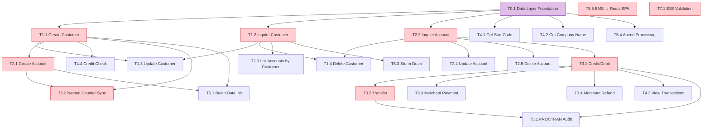

# Conversation WBS Plan — CBSA Full-Stack Migration Tasks

> This document defines the conversation-level WBS (Work Breakdown Structure) for the **complete CBSA migration** — not just COBOL-to-Java, but the full technology stack: COBOL business logic, Java JAX-RS/JCICS/JZOS API layers, z/OS Connect integration, Spring Boot Customer Services & Payment interfaces, React Carbon UI, BMS terminal screens, and JCL batch/infrastructure scripts. Each task corresponds to a business scenario from the [Business Scenarios](../../cics-banking-sample-application-cbsa/.asdm/contexts/business-scenarios.md) document.

---

## Migration Scope — Legacy Technology Layers

The CBSA is a multi-layered system. Each business scenario typically touches **5–8 technology layers** that must all be migrated:

| # | Legacy Layer | Technology | Count | Migration Target |
|---|-------------|-----------|-------|-----------------|
| L1 | **COBOL Programs** | COBOL/CICS | 29 | Java Spring `@Service` classes |
| L2 | **COBOL Copybooks** | COBOL data structures | 37 | Java POJOs / JPA Entities / DTOs |
| L3 | **BMS Mapsets** | 3270 terminal maps | 9 | React page components |
| L4 | **JAX-RS REST API** | Java (webui WAR) | 6 resources | Spring `@RestController` |
| L5 | **Db2 Data Access (JDBC)** | Java (web.db2) | 2 classes | Spring Data JPA `Repository` |
| L6 | **VSAM Data Access (JCICS)** | Java (web.vsam) | 1 class | Spring Data JPA `Repository` |
| L7 | **JZOS Data Interfaces** | Java (datainterfaces) | 8 classes | DTO mappers + Bean Validation |
| L8 | **z/OS Connect APIs** | Swagger 2.0 | 10 APIs | OpenAPI 3.0 + direct REST |
| L9 | **z/OS Connect Services** | Service Archives | 11 services | Eliminated (direct REST calls) |
| L10 | **Customer Services Interface** | Spring Boot + Thymeleaf | 1 app (32 Java files) | Merged into unified microservices + React SPA |
| L11 | **Payment Interface** | Spring Boot + Thymeleaf | 1 app (9 Java files) | Merged into transaction-service + React SPA |
| L12 | **React Carbon UI** | React 18.2 + IBM Carbon | 1 SPA | Upgraded to React 18.3 + TypeScript + Ant Design |
| L13 | **JCL Scripts** | JCL | 102 files | Spring Batch + Flyway + GitHub Actions |
| L14 | **CICS Resources** | PCT/PPT/FCT definitions | — | K8s ConfigMaps/Secrets + Spring Config |

---

## Task Index

| Task ID | Scenario | Title | Priority | Dependencies | Status |
|---------|----------|-------|----------|-------------|--------|
| T1.1 | 1.1 | Create Customer | P0 | T0.1 | Pending |
| T1.2 | 1.2 | Inquire Customer | P0 | T0.1 | Pending |
| T1.3 | 1.3 | Update Customer | P1 | T1.2 | Pending |
| T1.4 | 1.4 | Delete Customer | P1 | T1.2, T2.2 | Pending |
| T2.1 | 2.1 | Create Account | P0 | T1.1 | Pending |
| T2.2 | 2.2 | Inquire Account | P0 | T0.1 | Pending |
| T2.3 | 2.3 | List Accounts by Customer | P0 | T1.2 | Pending |
| T2.4 | 2.4 | Update Account | P1 | T2.2 | Pending |
| T2.5 | 2.5 | Delete Account | P1 | T2.2 | Pending |
| T3.1 | 3.1 | Credit / Debit | P0 | T2.2 | Pending |
| T3.2 | 3.2 | Transfer | P0 | T2.2, T3.1 | Pending |
| T3.3 | 3.3 | Merchant Payment (Debit) | P1 | T3.1 | Pending |
| T3.4 | 3.4 | Merchant Refund (Credit) | P1 | T3.1 | Pending |
| T4.1 | 4.1 | Get Sort Code | P2 | T0.1 | Pending |
| T4.2 | 4.2 | Get Company Name | P2 | T0.1 | Pending |
| T4.3 | 4.3 | View Processed Transactions | P1 | T3.1 | Pending |
| T4.4 | 4.4 | Credit Check (Async) | P1 | T1.1 | Pending |
| T5.1 | 5.1 | PROCTRAN Audit Trail | P1 | T3.1, T3.2 | Pending |
| T5.2 | 5.2 | Named Counter Synchronization | P0 | T1.1, T2.1 | Pending |
| T5.3 | 5.3 | Storm Drain Handling | P2 | T1.2 | Pending |
| T5.4 | 5.4 | Abend Processing | P2 | T0.1 | Pending |
| T5.5 | 5.5 | BMS Menu Navigation → React SPA | P0 | T1.1–T4.2 | Pending |
| T6.1 | 6.1 | Batch Data Initialization | P1 | T2.1, T1.1 | Pending |
| T7.1 | 7.1 | End-to-End Integration Validation | P0 | T1.1–T6.1 | Pending |

> **Priority**: P0 = must-have for MVP, P1 = required for parity, P2 = nice-to-have / edge case.

---

## Task Groups by Domain

### Group 0 — Data Layer Foundation (all services)

> Before any business scenario can be migrated, the data layer must be in place: JPA entities from COBOL copybooks, Flyway migrations from Db2/VSAM schemas, and Spring Data JPA repositories from JDBC/JCICS data access classes.

| Task ID | Title | Legacy Sources | Target |
|---------|-------|---------------|--------|
| T0.1 | Data Layer Foundation | **Copybooks**: `ACCOUNT.cpy`, `CUSTOMER.cpy`, `PROCTRAN.cpy`, `ACCTCTRL.cpy`, `CONTDB2.cpy`, `ACCDB2.cpy`, `PROCDB2.cpy`, `SORTCODE.cpy`, `ABNDINFO.cpy`, `NEWACCNO.cpy`, `NEWCUSNO.cpy`, `CREACC.cpy`, `CRECUST.cpy`, `INQACC.cpy`, `INQCUST.cpy`, `UPDACC.cpy`, `UPDCUST.cpy`, `DELACC.cpy`, `DELCUS.cpy`, `PAYDBCR.cpy`, `XFRFUN.cpy` **JDBC DAO**: `web.db2.Account.java`, `web.db2.ProcessedTransaction.java` **JCICS DAO**: `web.vsam.Customer.java` **JZOS**: `datainterfaces/CRECUST.java`, `datainterfaces/CUSTOMER.java`, `datainterfaces/CustomerControl.java`, `datainterfaces/NewAccountNumber.java`, `datainterfaces/NewCustomerNumber.java`, `datainterfaces/PROCTRAN.java`, `datainterfaces/GetCompany.java`, `datainterfaces/GetSortCode.java` **Db2 DDL**: JCL `CRETB01-03.jcl`, `CRETS01-03.jcl`, `CREI101-301.jcl` **VSAM**: CUSTOMER KSDS, ABNDFILE KSDS | JPA entities: `BankAccount`, `BankCustomer`, `BankProctran`, `BankControl` Flyway migrations: `V1__Create_bank_account_table.sql`, `V1__Create_bank_customer_table.sql`, `V1__Create_bank_proctran_table.sql`, `V2__Create_bank_control_table.sql` Repositories: `AccountRepository`, `CustomerRepository`, `ProctranRepository`, `ControlRepository` |

### Group 1 — Customer Management (customer-service)

| Task ID | Title | All Legacy Sources | Target |
|---------|-------|-------------------|--------|
| T1.1 | Create Customer | **COBOL**: `CRECUST.cbl`, `CRDTAGY1-5.cbl` **Copybooks**: `CRECUST.cpy`, `CUSTOMER.cpy`, `CUSTCTRL.cpy`, `SORTCODE.cpy`, `NEWCUSNO.cpy`, `STCUSTNO.cpy`, `PROCISRT.cpy`, `PROCTRAN.cpy` **JAX-RS**: `CustomerResource.java` (POST) **JCICS**: `web.vsam.Customer.java` (write) **JZOS**: `datainterfaces/CRECUST.java`, `datainterfaces/CUSTOMER.java`, `datainterfaces/NewCustomerNumber.java`, `datainterfaces/CustomerControl.java` **z/OS Connect**: crecust API + CScustcre service **CS Interface**: `createcustomer/CreateCustomerJson.java`, `createcustomer/CreateCustomerForm.java`, `createcustomer/CrecustJson.java` **BMS**: `BNK1CCM.bms` (menu), `BNK1CCS.bms` (screen), `BNK1CCA.bms` (confirm) **JCL**: `CRECUST.jcl` (build), `BNK1CCM.jcl`, `BNK1CCS.jcl`, `BNK1CCA.jcl` | `CustomerService.createCustomer()` `CreditScoreService.calculateScore()` `CustomerController` (POST) `CustomerCreateRequest` / `CustomerResponse` DTOs `CreateCustomerPage.tsx` Flyway seed data for control table |
| T1.2 | Inquire Customer | **COBOL**: `INQCUST.cbl` **Copybooks**: `INQCUST.cpy`, `INQCUSTZ.cpy`, `CUSTOMER.cpy`, `SORTCODE.cpy` **JAX-RS**: `CustomerResource.java` (GET) **JCICS**: `web.vsam.Customer.java` (read + storm drain) **JZOS**: `datainterfaces/CUSTOMER.java` **z/OS Connect**: inqcustz API + CScustenq service **CS Interface**: `customerenquiry/CustomerEnquiryJson.java`, `customerenquiry/CustomerEnquiryForm.java`, `customerenquiry/InqCustZJson.java`, `customerenquiry/InqCustDob.java`, `customerenquiry/InqCustReviewDate.java` **BMS**: `BNK1MAI.bms` (option 1) | `CustomerService.getCustomer()` `CustomerController` (GET) `CustomerResponse` DTO Storm drain → Resilience4j Retry |
| T1.3 | Update Customer | **COBOL**: `UPDCUST.cbl` **Copybooks**: `UPDCUST.cpy`, `CUSTOMER.cpy`, `SORTCODE.cpy` **JAX-RS**: `CustomerResource.java` (PUT) **JCICS**: `web.vsam.Customer.java` (rewrite) **z/OS Connect**: updcust API + CScustupd service **CS Interface**: `updatecustomer/UpdateCustomerJson.java`, `updatecustomer/UpdateCustomerForm.java`, `updatecustomer/UpdcustJson.java` **BMS**: `BNK1MAI.bms` (option 8) | `CustomerService.updateCustomer()` `CustomerController` (PUT) `CustomerUpdateRequest` DTO |
| T1.4 | Delete Customer | **COBOL**: `DELCUS.cbl` **Copybooks**: `DELCUS.cpy`, `CUSTOMER.cpy`, `SORTCODE.cpy`, `PROCISRT.cpy`, `PROCTRAN.cpy` **JAX-RS**: `CustomerResource.java` (DELETE) **JCICS**: `web.vsam.Customer.java` (delete) **JDBC**: `web.db2.Account.java` (cascade query via INQACCCU) **z/OS Connect**: delcus API + CScustdel service **CS Interface**: `deletecustomer/DeleteCustomerJson.java`, `deletecustomer/DelcusJson.java` **BMS**: `BNK1DCM.bms` (menu), `BNK1CDM.bms` (confirm) **JCL**: `DELCUS.jcl` | `CustomerService.deleteCustomer()` (cascading, calls account-service API) `CustomerController` (DELETE) `DeleteCustomerPage.tsx` |

### Group 2 — Account Management (account-service)

| Task ID | Title | All Legacy Sources | Target |
|---------|-------|-------------------|--------|
| T2.1 | Create Account | **COBOL**: `CREACC.cbl` **Copybooks**: `CREACC.cpy`, `ACCOUNT.cpy`, `ACCTCTRL.cpy`, `CONTDB2.cpy`, `NEWACCNO.cpy`, `PROCISRT.cpy`, `PROCTRAN.cpy`, `SORTCODE.cpy` **JAX-RS**: `AccountsResource.java` (POST) **JDBC**: `web.db2.Account.java` (insert) **JZOS**: `datainterfaces/NewAccountNumber.java` **z/OS Connect**: creacc API + CSacccre service **CS Interface**: `createaccount/CreateAccountJson.java`, `createaccount/CreateAccountForm.java`, `createaccount/CreaccJson.java`, `createaccount/CreaccKeyJson.java`, `createaccount/AccountType.java` **BMS**: `BNK1CAM.bms` (menu), `BNK1CAC.bms` (screen) **JCL**: `CREACC.jcl`, `BNK1CAM.jcl`, `BNK1CAC.jcl` | `AccountService.createAccount()` `AccountController` (POST) `AccountCreateRequest` / `AccountResponse` DTOs `CreateAccountPage.tsx` Named counter → `SELECT ... FOR UPDATE` on control table |
| T2.2 | Inquire Account | **COBOL**: `INQACC.cbl` **Copybooks**: `INQACC.cpy`, `INQACCZ.cpy`, `ACCOUNT.cpy`, `SORTCODE.cpy` **JAX-RS**: `AccountsResource.java` (GET single) **JDBC**: `web.db2.Account.java` (read) **z/OS Connect**: inqaccz API + CSaccenq service **CS Interface**: `accountenquiry/AccountEnquiryJson.java`, `accountenquiry/AccountEnquiryForm.java`, `accountenquiry/InqaccJson.java` **BMS**: `BNK1MAI.bms` (option 2), `BNK1ACC.bms` | `AccountService.getAccount()` `AccountController` (GET) `AccountResponse` DTO `AccountMenuPage.tsx` |
| T2.3 | List Accounts by Customer | **COBOL**: `INQACCCU.cbl` **Copybooks**: `INQACCCU.cpy`, `INQACCCZ.cpy`, `ACCOUNT.cpy`, `SORTCODE.cpy` **JAX-RS**: `AccountsResource.java` (GET by customer) **JDBC**: `web.db2.Account.java` (query by customer) **z/OS Connect**: inqacccz API + CScustacc service (note: maps to CSaccacc service name in CBSA) **CS Interface**: `listaccounts/AccountDetails.java`, `listaccounts/InqAccczJson.java`, `listaccounts/ListAccJson.java` **BMS**: `BNK1MAI.bms` (option A) | `AccountService.getAccountsByCustomer()` `AccountController` (GET by customer) Cross-service call: customer-service → account-service |
| T2.4 | Update Account | **COBOL**: `UPDACC.cbl` **Copybooks**: `UPDACC.cpy`, `ACCOUNT.cpy`, `SORTCODE.cpy` **JAX-RS**: `AccountsResource.java` (PUT) **JDBC**: `web.db2.Account.java` (update) **z/OS Connect**: updacc API + CSaccupd service **CS Interface**: `updateaccount/UpdateAccountJson.java`, `updateaccount/UpdateAccountForm.java`, `updateaccount/UpdaccJson.java` **BMS**: `BNK1UAM.bms` (menu), `BNK1UAC.bms` (screen) **JCL**: `UPDACC.jcl`, `BNK1UAM.jcl`, `BNK1UAC.jcl` | `AccountService.updateAccount()` `AccountController` (PUT) `AccountUpdateRequest` DTO `UpdateAccountPage.tsx` |
| T2.5 | Delete Account | **COBOL**: `DELACC.cbl` **Copybooks**: `DELACC.cpy`, `DELACCZ.cpy`, `ACCOUNT.cpy`, `SORTCODE.cpy`, `PROCISRT.cpy`, `PROCTRAN.cpy` **JAX-RS**: `AccountsResource.java` (DELETE) **JDBC**: `web.db2.Account.java` (delete) **z/OS Connect**: delacc API + CSaccdel service **CS Interface**: `deleteaccount/DeleteAccountJson.java`, `deleteaccount/DelaccJson.java` **BMS**: `BNK1DAM.bms` (menu), `BNK1DAC.bms` (screen) **JCL**: `DELACC.jcl`, `BNK1DAM.jcl`, `BNK1DAC.jcl` | `AccountService.deleteAccount()` `AccountController` (DELETE) `DeleteAccountPage.tsx` |

### Group 3 — Financial Transactions (transaction-service)

| Task ID | Title | All Legacy Sources | Target |
|---------|-------|-------------------|--------|
| T3.1 | Credit / Debit | **COBOL**: `DBCRFUN.cbl` **Copybooks**: `PAYDBCR.cpy`, `ACCOUNT.cpy`, `PROCISRT.cpy`, `PROCTRAN.cpy`, `SORTCODE.cpy`, `RESPSTR.cpy` **JAX-RS**: `AccountsResource.java` (debit/credit endpoints), `DebitCreditAccountJSON.java`, `CreditScore.java`, `CreditScoreCICS540.java` **JDBC**: `web.db2.Account.java` (balance update), `web.db2.ProcessedTransaction.java` (proctran insert) **JZOS**: `datainterfaces/PROCTRAN.java` **z/OS Connect**: makepayment API + Pay service **Payment Interface**: `WebController.java`, `DbcrJson.java`, `OriginJson.java`, `PaymentInterfaceJson.java` **BMS**: `BNK1MAI.bms` (option 6) **JCL**: `DBCRFUN.jcl` | `TransactionService.debitCredit()` `TransactionController` (POST /debit-credit) `DebitCreditRequest` / `TransactionResponse` DTOs Two-phase commit: `@Transactional` (account update + proctran insert) Payment context: `FACILTYPE` → request header or DTO field |
| T3.2 | Transfer | **COBOL**: `XFRFUN.cbl` (66.8 KB — largest program) **Copybooks**: `XFRFUN.cpy`, `ACCOUNT.cpy`, `PROCISRT.cpy`, `PROCTRAN.cpy`, `SORTCODE.cpy`, `RESPSTR.cpy` **JAX-RS**: `AccountsResource.java` (transfer endpoint), `TransferLocalJSON.java`, `ProcessedTransactionTransferLocalJSON.java` **JDBC**: `web.db2.Account.java` (dual balance update), `web.db2.ProcessedTransaction.java` (2× proctran insert) **CS Interface**: (no CS transfer — teller only) **BMS**: `BNK1TFM.bms` (menu), `BNK1TFN.bms` (screen) **JCL**: `XFRFUN.jcl`, `BNK1TFM.jcl`, `BNK1TFN.jcl` | `TransactionService.transfer()` `TransactionController` (POST /transfer) `TransferRequest` / `TransactionResponse` DTOs Saga or `@Transactional` for cross-account debit+credit Deadlock retry: Resilience4j Retry on PostgreSQL deadlock `TransferPage.tsx` |
| T3.3 | Merchant Payment (Debit) | **COBOL**: `DBCRFUN.cbl` (FACILTYPE=496 path) **Payment Interface**: `WebController.java` (debit path), `DbcrJson.java`, `OriginJson.java`, `TransferForm.java` **z/OS Connect**: makepayment API (debit) | Same `TransactionService.debitCredit()` with `facilType=496` Business rule: reject MORTGAGE/LOAN account debits `PaymentPage.tsx` (new — for merchant interface) |
| T3.4 | Merchant Refund (Credit) | **COBOL**: `DBCRFUN.cbl` (FACILTYPE=496 path, credit direction) **Payment Interface**: `WebController.java` (credit path) | Same `TransactionService.debitCredit()` with credit flag All account types accept credits `PaymentPage.tsx` (shared with T3.3) |

### Group 4 — Administrative

| Task ID | Title | All Legacy Sources | Target |
|---------|-------|-------------------|--------|
| T4.1 | Get Sort Code | **COBOL**: `GETSCODE.cbl` **Copybooks**: `GETSCODE.cpy`, `SORTCODE.cpy` **JAX-RS**: `SortCodeResource.java` **JZOS**: `datainterfaces/GetSortCode.java` **CS Interface**: used by all CS forms for sortcode | `BankInfoService.getSortCode()` `BankInfoController` (GET /bank/sort-code) Externalized to `application.yml` |
| T4.2 | Get Company Name | **COBOL**: `GETCOMPY.cbl` **Copybooks**: `GETCOMPY.cpy` **JAX-RS**: `CompanyNameResource.java` **JZOS**: `datainterfaces/GetCompany.java` | `BankInfoService.getCompanyName()` `BankInfoController` (GET /bank/company-name) Externalized to `application.yml` |
| T4.3 | View Processed Transactions | **JAX-RS**: `ProcessedTransactionResource.java`, `ProcessedTransactionJSON.java`, `ProcessedTransactionAccountJSON.java`, `ProcessedTransactionCreateCustomerJSON.java`, `ProcessedTransactionDebitCreditJSON.java`, `ProcessedTransactionDeleteCustomerJSON.java`, `ProcessedTransactionTransferLocalJSON.java` **JDBC**: `web.db2.ProcessedTransaction.java` **JZOS**: `datainterfaces/PROCTRAN.java` **BMS**: `BNK1MAI.bms` (option 9) | `TransactionService.listTransactions()` `TransactionController` (GET /transactions) `TransactionResponse` DTO with type-code mapping |
| T4.4 | Credit Check (Async) | **COBOL**: `CRDTAGY1-5.cbl` (5 async programs) **JAX-RS**: `CreditScore.java`, `CreditScoreCICS540.java` **CICS**: Async API (START/WAIT), channels & containers | `CreditScoreService.calculateScore()` Replace CICS Async API with `@Async` + `CompletableFuture` 5 parallel score simulations → average 3-second timeout with partial results |

### Group 5 — Cross-Cutting Concerns

| Task ID | Title | All Legacy Sources | Target |
|---------|-------|-------------------|--------|
| T5.1 | PROCTRAN Audit Trail | **COBOL**: PROCTRAN writes in `CREACC.cbl`, `DELACC.cbl`, `CRECUST.cbl`, `DELCUS.cbl`, `DBCRFUN.cbl`, `XFRFUN.cbl` **Copybooks**: `PROCTRAN.cpy`, `PROCISRT.cpy`, `PROCDB2.cpy` **JDBC**: `web.db2.ProcessedTransaction.java` **JZOS**: `datainterfaces/PROCTRAN.java` **JAX-RS**: `ProcessedTransactionResource.java` (write side) | `@Transactional` ensures PROCTRAN insert + business update are atomic Transaction-service owns `bank_proctran` table 17 transaction type codes preserved |
| T5.2 | Named Counter Synchronization | **COBOL**: `ENQ CUSTNO`/`DEQ CUSTNO` in `CRECUST.cbl`, `ENQ ACCNO`/`DEQ ACCNO` in `CREACC.cbl` **Copybooks**: `NEWACCNO.cpy`, `NEWCUSNO.cpy`, `STCUSTNO.cpy`, `ACCTCTRL.cpy`, `CUSTCTRL.cpy` **JZOS**: `datainterfaces/NewAccountNumber.java`, `datainterfaces/NewCustomerNumber.java`, `datainterfaces/CustomerControl.java` **VSAM**: Customer control record + Db2 CONTROL table | `SELECT ... FOR UPDATE` on `bank_control` table in account-service Alternative: PostgreSQL sequences for account/customer numbers Counter increment within `@Transactional` |
| T5.3 | Storm Drain Handling | **COBOL**: `INQCUST.cbl` — VSAM `SYSIDERR` retry loop (100×, 3s delay) **JCICS**: `web.vsam.Customer.java` (retry logic) | Resilience4j `@Retry` with exponential backoff Configurable: max attempts, wait duration, retry on `DataAccessResourceFailureException` |
| T5.4 | Abend Processing | **COBOL**: `ABNDPROC.cbl` **Copybooks**: `ABNDINFO.cpy` **VSAM**: ABNDFILE KSDS | Global `@ControllerAdvice` + `ErrorResponse` Structured error logging (SLF4J + JSON layout) Optional: `abend_log` PostgreSQL table for persistent error records |
| T5.5 | BMS Menu Navigation → React SPA | **BMS**: All 9 mapsets — `BNK1MAI.bms`, `BNK1CAM.bms`, `BNK1CCM.bms`, `BNK1CDM.bms`, `BNK1DAM.bms`, `BNK1DCM.bms`, `BNK1TFM.bms`, `BNK1UAM.bms`, `BNK1ACC.bms` **COBOL BMS controllers**: `BNKMENU.cbl`, `BNK1CAC.cbl`, `BNK1CCA.cbl`, `BNK1CCS.cbl`, `BNK1CRA.cbl`, `BNK1DAC.cbl`, `BNK1DCS.cbl`, `BNK1TFN.cbl`, `BNK1UAC.cbl` **Copybook**: `BANKMAP.cpy` (all BMS field definitions), `BNK1DDM.cpy` **React Carbon UI**: Existing SPA in `webui/` (upgrade target) | React SPA with `react-router-dom` navigation 8 page components mapped from BMS mapsets `HomePage` ← `BNK1MAI` (main menu) `Layout.tsx` — sidebar navigation replaces 3270 menu `ATTRB=UNPROT` → editable input, `ATTRB=PROT` → read-only PF3 → back button, PF5 → submit |

### Group 6 — Batch Processing

| Task ID | Title | All Legacy Sources | Target |
|---------|-------|-------------------|--------|
| T6.1 | Batch Data Initialization | **COBOL**: `BANKDATA.cbl` (54 KB — sample data generator) **JCL Build**: `BANKDATA.jcl`, `COMPALL.jcl`, `BATCH.jcl` **JCL Install**: `installjcl/BANKDATA.jcl`, `CREDB2L.jcl`, `CREL001-011.jcl` **JCL Db2**: `CRETB01-03.jcl`, `CRETS01-03.jcl`, `CREI101-301.jcl`, `CRESG01-03.jcl`, `INSTDB2.jcl` **JCL CICS**: `CICS.jcl`, `CBSACSD.jcl`, `CICSTS56.jcl` | Spring Batch `dataInitializerJob` Db2 DDL → Flyway migrations JCL compile/link → Maven build JCL install → `docker-compose up` + Flyway BANKDATA sample generation → `sample-data.csv` + batch step GitHub Actions CI/CD pipeline from build JCL |

### Group 7 — Validation

| Task ID | Title | Scope |
|---------|-------|-------|
| T7.1 | End-to-End Integration Validation | All layers — functional equivalence testing: • 10 z/OS Connect API operations vs new REST endpoints • BMS screen flows vs React page flows • COBOL business rules vs Java service logic • CS/Payment Interface scenarios vs new microservice calls • JCL batch outputs vs Spring Batch results • Data integrity: Db2+VSAM records vs PostgreSQL tables • Performance: legacy response time vs modern (flag if >2x) |

---

## Dependency Graph

> Purple = foundation task, Red = P0 (must-have for MVP).

---

## Suggested Execution Order

Based on dependencies and priority, the recommended conversation execution order:

| Wave | Tasks | Rationale |
|------|-------|-----------|
| **Wave 0** | T0.1 | Data Layer Foundation: entities, migrations, repositories from all copybooks + JDBC/JCICS/JZOS classes |
| **Wave 1** | T1.2, T2.2, T4.1, T4.2, T5.4 | Foundation: read-only operations + simple config lookups + abend handler |
| **Wave 2** | T5.2, T1.1, T4.4 | Named counter infrastructure + Create Customer (needs counter) + Credit Check |
| **Wave 3** | T2.1, T2.3 | Create Account (needs customer + counter) + List Accounts by Customer |
| **Wave 4** | T1.3, T2.4, T1.4, T2.5 | Update/Delete operations for Customer and Account |
| **Wave 5** | T3.1, T5.1 | Credit/Debit (core financial) + PROCTRAN audit trail |
| **Wave 6** | T3.2, T3.3, T3.4 | Transfer + Merchant Payment/Refund (Payment Interface migration) |
| **Wave 7** | T4.3, T5.3 | View Transactions (ProcessedTransactionResource migration) + Storm Drain |
| **Wave 8** | T6.1, T5.5 | Batch Data Init (JCL migration) + BMS → React SPA |
| **Wave 9** | T7.1 | End-to-end integration validation (all layers) |

---

## Task Detail Documents

> Each task below will have a dedicated detail document at `.asdm/workspace/planning/tasks/T{ID}.md` containing: existing file tree, target file tree, detailed conversion steps, and validation criteria. These documents will be created in subsequent conversations.

| Task ID | Detail Document |
|---------|----------------|
| T0.1 | `tasks/T0.1-data-layer-foundation.md` |
| T1.1 | `tasks/T1.1-create-customer.md` |
| T1.2 | `tasks/T1.2-inquire-customer.md` |
| T1.3 | `tasks/T1.3-update-customer.md` |
| T1.4 | `tasks/T1.4-delete-customer.md` |
| T2.1 | `tasks/T2.1-create-account.md` |
| T2.2 | `tasks/T2.2-inquire-account.md` |
| T2.3 | `tasks/T2.3-list-accounts-by-customer.md` |
| T2.4 | `tasks/T2.4-update-account.md` |
| T2.5 | `tasks/T2.5-delete-account.md` |
| T3.1 | `tasks/T3.1-credit-debit.md` |
| T3.2 | `tasks/T3.2-transfer.md` |
| T3.3 | `tasks/T3.3-merchant-payment.md` |
| T3.4 | `tasks/T3.4-merchant-refund.md` |
| T4.1 | `tasks/T4.1-get-sort-code.md` |
| T4.2 | `tasks/T4.2-get-company-name.md` |
| T4.3 | `tasks/T4.3-view-transactions.md` |
| T4.4 | `tasks/T4.4-credit-check.md` |
| T5.1 | `tasks/T5.1-proctran-audit.md` |
| T5.2 | `tasks/T5.2-named-counter-sync.md` |
| T5.3 | `tasks/T5.3-storm-drain.md` |
| T5.4 | `tasks/T5.4-abend-processing.md` |
| T5.5 | `tasks/T5.5-bms-to-react.md` |
| T6.1 | `tasks/T6.1-batch-data-init.md` |
| T7.1 | `tasks/T7.1-e2e-validation.md` |

---

## Version History

| Version | Date | Change | Author |
|---------|------|--------|--------|
| 2.0.0 | 2026-04-15 | Expanded scope: full-stack migration WBS — all legacy technology layers (COBOL, JAX-RS, JCICS, JZOS, z/OS Connect, CS/Payment interfaces, React Carbon, BMS, JCL) mapped per task; added T0.1 Data Layer Foundation; updated execution waves | ASDM Planning |
| 1.0.0 | 2026-04-15 | Initial WBS overview with task list, dependency graph, and execution waves | ASDM Planning |
