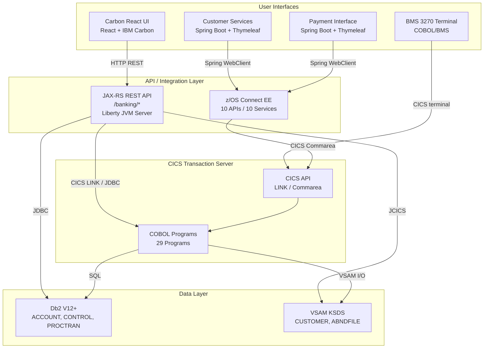
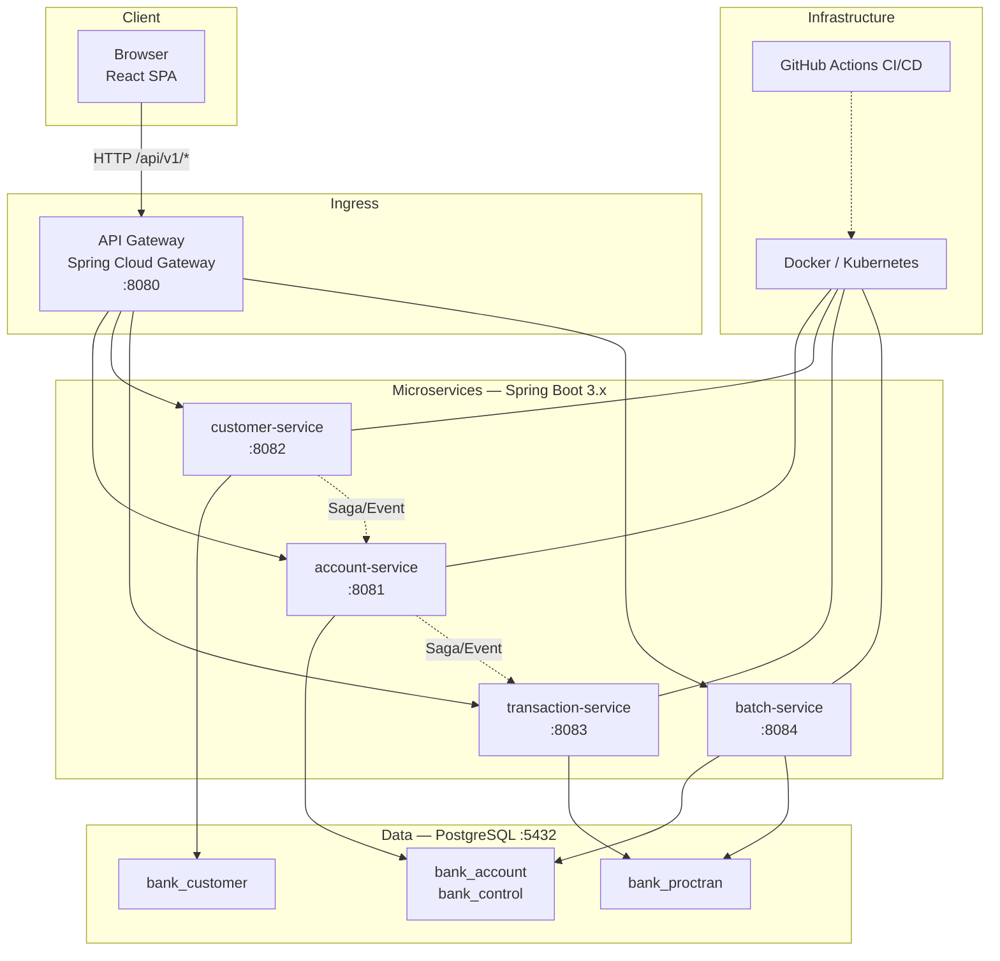

# ASDM Mainframe Modernizer Sample

> **[ASDM](https://asdm.ai)** (AI-First System Development Methodology) is a methodology that places AI at the core of the software development lifecycle — accelerating development, deployment, and maintenance of intelligent systems.

A sample project demonstrating mainframe-to-cloud modernization using the ASDM Mainframe Modernizer toolset. This repository contains both the legacy IBM CICS Banking Sample Application and its modernized cloud-native counterpart as git submodules.

## Repository Structure

```
asdm-mainframe-modernizer-sample/
├── cics-banking-sample-application-cbsa/   ← Legacy (submodule)
├── modern-cics-banking-sample-application-cbsa/  ← Modern (submodule)
└── README.md
```

| Submodule | Description | Repo |
|-----------|-------------|------|
| `cics-banking-sample-application-cbsa` | Legacy IBM CICS Banking Sample Application — COBOL/CICS/Db2/VSAM on z/OS | [ups216/cics-banking-sample-application-cbsa](https://github.com/ups216/cics-banking-sample-application-cbsa) |
| `modern-cics-banking-sample-application-cbsa` | Modernized cloud-native banking app — Spring Boot/React/PostgreSQL on x86 Linux | [ups216/modern-cics-banking-sample-application-cbsa](https://github.com/ups216/modern-cics-banking-sample-application-cbsa) |

## Modernization Overview

| Aspect | Before (Mainframe) | After (Modern) |
|--------|-------------------|----------------|
| **Runtime** | CICS Transaction Server on z/OS | Spring Boot 3.x on x86 Linux |
| **Business Logic** | 29 COBOL Programs | Java 17 / Spring Services |
| **Data Structures** | 37 COBOL Copybooks | JPA Entities / DTOs |
| **UI** | 9 BMS Mapsets (3270 Terminal) | React + TypeScript + Ant Design SPA |
| **Database** | Db2 + VSAM KSDS | PostgreSQL |
| **Batch** | 102 JCL Scripts | Spring Batch + GitHub Actions |
| **Integration** | z/OS Connect EE | Spring Cloud Gateway |
| **Deployment** | z/OS LPAR | Docker / Kubernetes |

## Getting Started

### Clone with Submodules

```bash
git clone --recurse-submodules git@github.com:ups216/asdm-mainframe-modernizer-sample.git
```

If you already cloned without submodules:

```bash
git submodule init
git submodule update
```

### Modern Application Quick Start

See [modern-cics-banking-sample-application-cbsa/README.md](modern-cics-banking-sample-application-cbsa/README.md) for full details.

```bash
cd modern-cics-banking-sample-application-cbsa

# Build backend
mvn clean package

# Build frontend
cd frontend && npm install && npm run build

# Run with Docker Compose
docker-compose up
```

## Architecture

### Before — Mainframe (z/OS)



### After — Cloud-Native (x86 Linux)



## COBOL-to-Java Mapping

| COBOL Program | Microservice | REST Endpoint |
|---------------|-------------|---------------|
| CREACC | account-service | `POST /api/v1/accounts` |
| INQACC | account-service | `GET /api/v1/accounts/{sortcode}/{number}` |
| UPDACC | account-service | `PUT /api/v1/accounts/{sortcode}/{number}` |
| DELACC | account-service | `DELETE /api/v1/accounts/{sortcode}/{number}` |
| CRECUST | customer-service | `POST /api/v1/customers` |
| INQCUST | customer-service | `GET /api/v1/customers/{sortcode}/{number}` |
| XFRFUN | transaction-service | `POST /api/v1/transactions/transfer` |
| DBCRFUN | transaction-service | `POST /api/v1/transactions/debit-credit` |

## BMS-to-React Mapping

| BMS Map | React Page | Route |
|---------|-----------|-------|
| BNK1MAI (Main Menu) | HomePage | `/` |
| BNK1CAM (Create Account) | CreateAccountPage | `/accounts/create` |
| BNK1CCM (Create Customer) | CreateCustomerPage | `/customers/create` |
| BNK1TFM (Transfer Funds) | TransferPage | `/transactions/transfer` |
| BNK1DAM (Delete Account) | DeleteAccountPage | `/accounts/delete` |
| BNK1DCM (Delete Customer) | DeleteCustomerPage | `/customers/delete` |
| BNK1UAM (Update Account) | UpdateAccountPage | `/accounts/update` |

## License

This project is provided as a sample for demonstration purposes. The legacy CBSA code is based on the [IBM CICS Banking Sample Application](https://github.com/IBM/cics-banking-sample-application-cbsa).
