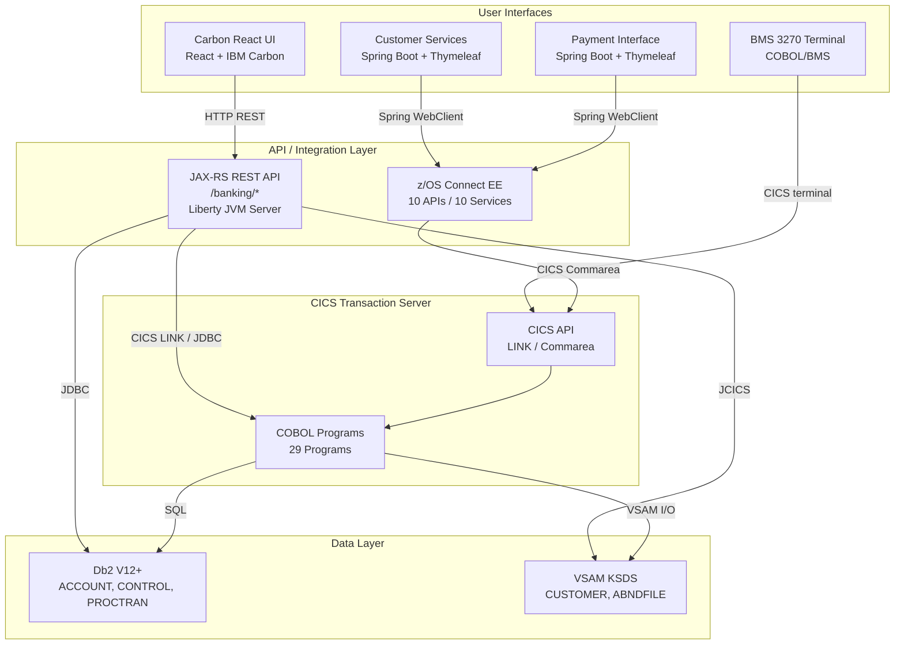
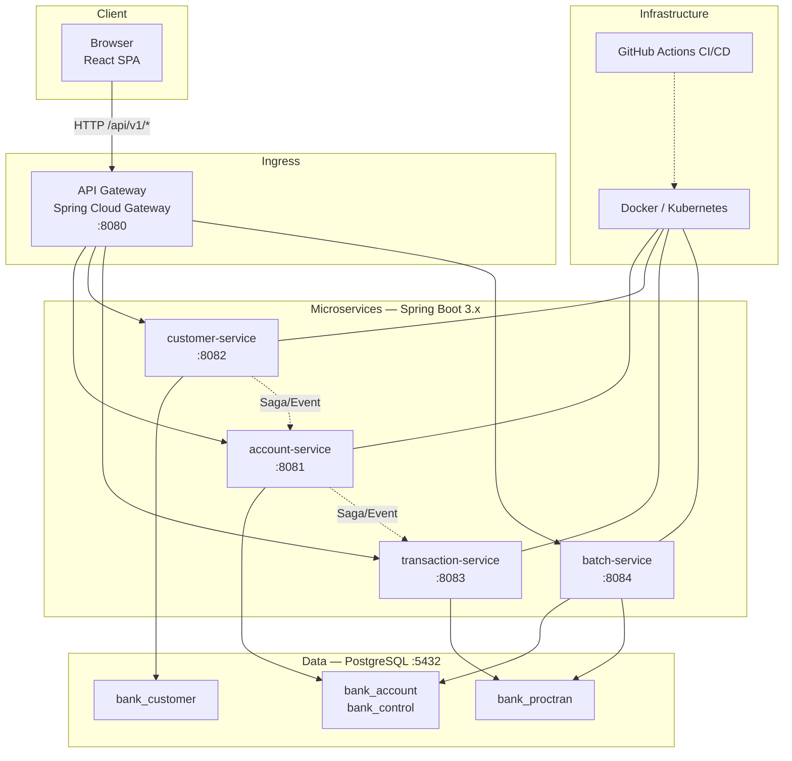

# ASDM Mainframe Modernizer Sample

> **[ASDM](https://asdm.ai)** (AI-First System Development Methodology) is a methodology that places AI at the core of the software development lifecycle — accelerating development, deployment, and maintenance of intelligent systems.

> **[中文版本](README_CN.md)** | **[English Version](README.md)**

A sample project demonstrating mainframe-to-cloud modernization using the ASDM Mainframe Modernizer toolset. This repository contains both the legacy IBM CICS Banking Sample Application and its modernized cloud-native counterpart as git submodules.

The project serves as an end-to-end reference for organizations looking to modernize their mainframe workloads. It covers the full transformation journey — from inventorying legacy COBOL programs, BMS mapsets, and JCL scripts, through architecture design, code transformation, and finally to a fully containerized cloud-native deployment running on x86 Linux.

## Repository Structure

This repository uses **git submodules** to keep the legacy and modern codebases in separate, independently versioned repositories while providing a single entry point for the full modernization sample.

```
asdm-mainframe-modernizer-sample/
├── cics-banking-sample-application-cbsa/         ← Legacy (submodule)
├── modern-cics-banking-sample-application-cbsa/  ← Modern (submodule)
└── README.md
```

| Submodule | Description | Repo |
|-----------|-------------|------|
| `cics-banking-sample-application-cbsa` | Legacy IBM CICS Banking Sample Application — COBOL/CICS/Db2/VSAM on z/OS. Contains 29 COBOL programs, 37 copybooks, 9 BMS mapsets, 102 JCL scripts, JAX-RS REST APIs, and z/OS Connect service definitions. | [ups216/cics-banking-sample-application-cbsa](https://github.com/ups216/cics-banking-sample-application-cbsa) |
| `modern-cics-banking-sample-application-cbsa` | Modernized cloud-native banking app — Spring Boot/React/PostgreSQL on x86 Linux. Contains 4 Spring Boot microservices, an API Gateway, a React SPA frontend, Flyway migrations, Docker Compose, and Kubernetes manifests. | [ups216/modern-cics-banking-sample-application-cbsa](https://github.com/ups216/modern-cics-banking-sample-application-cbsa) |

## Modernization Overview

The table below summarizes the key technology replacements across every layer of the stack. Each row represents a fundamental shift from mainframe-specific technology to an open, cloud-native equivalent — driven by the ASDM Mainframe Modernizer toolset's automated transformation rules.

| Aspect | Before (Mainframe) | After (Modern) |
|--------|-------------------|----------------|
| **Runtime** | CICS Transaction Server on z/OS | Spring Boot 3.x on x86 Linux |
| **Business Logic** | 29 COBOL Programs | Java 17 / Spring Services |
| **Data Structures** | 37 COBOL Copybooks | JPA Entities / DTOs |
| **UI** | 9 BMS Mapsets (3270 Terminal) | React + TypeScript + Ant Design SPA |
| **Database** | Db2 + VSAM KSDS | PostgreSQL |
| **Batch** | 102 JCL Scripts | Spring Batch + GitHub Actions |
| **Integration** | z/OS Connect EE | Spring Cloud Gateway |
| **Deployment** | z/OS LPAR | Docker / Kubernetes |

## Getting Started

### Clone with Submodules

Since this project uses git submodules, you must clone with `--recurse-submodules` to get both the legacy and modern codebases:

```bash
git clone --recurse-submodules git@github.com:ups216/asdm-mainframe-modernizer-sample.git
```

If you already cloned without submodules, initialize and update them with:

```bash
git submodule init
git submodule update
```

To pull the latest changes from both submodules later:

```bash
git submodule update --remote
```

### Prerequisites

- **Java 17+** (LTS) — for building and running Spring Boot services
- **Maven 3.9+** — for backend build and dependency management
- **Node.js 20 LTS** — for building the React frontend
- **Docker & Docker Compose** — for running the full stack locally

### Modern Application Quick Start

The quickest way to get the modernized application running is via Docker Compose, which spins up PostgreSQL, all microservices, the API Gateway, and the frontend:

```bash
cd modern-cics-banking-sample-application-cbsa

# Build backend
mvn clean package

# Build frontend
cd frontend && npm install && npm run build

# Run with Docker Compose
docker-compose up
```

See [modern-cics-banking-sample-application-cbsa/README.md](modern-cics-banking-sample-application-cbsa/README.md) for full details, including how to run individual services locally for development.

## Architecture

### Before — Mainframe (z/OS)

The original CBSA runs on IBM z/OS with CICS Transaction Server as the runtime. It features a multi-layered architecture with 4 distinct user interfaces (BMS 3270 terminal, Carbon React UI, Customer Services, and Payment Interface) all accessing shared COBOL business logic through CICS LINK and Commarea. Data is stored in Db2 relational tables and VSAM key-sequenced datasets.



**Key characteristics:**
- **Monolithic COBOL core** — all 29 programs share a single CICS address space and communicate via LINK/XCTL and binary Commarea
- **Multiple UI frontends** — BMS 3270 for traditional terminal access, plus 3 web-based interfaces running on Liberty JVM Server
- **Mixed data access** — Db2 for relational data (ACCOUNT, PROCTRAN, CONTROL) and VSAM KSDS for keyed access (CUSTOMER, ABNDFILE)
- **z/OS Connect bridge** — exposes CICS programs as REST APIs for the Spring Boot web UIs

### After — Cloud-Native (x86 Linux)

The modernized system is a cloud-native microservices architecture running on x86 Linux, containerized with Docker, and orchestrated by Kubernetes in production. It replaces the monolithic CICS/COBOL/Db2/VSAM stack with Spring Boot services, PostgreSQL, and a unified React SPA — all behind a Spring Cloud Gateway API Gateway.



**Key characteristics:**
- **Microservices decomposition** — 4 independent services (account, customer, transaction, batch) each owning their database schema (database-per-service pattern)
- **API Gateway routing** — all external requests enter through Spring Cloud Gateway at `/api/v1/*`, which routes to the appropriate backend service
- **Unified React SPA** — replaces all 4 legacy UIs with a single modern web application using TypeScript, Ant Design, and Vite
- **PostgreSQL** — replaces both Db2 and VSAM, using properly indexed relational tables with Flyway-managed migrations
- **Saga pattern** — cross-service transactions (e.g., fund transfer between accounts) use Saga orchestration with compensating transactions for consistency
- **Containerized deployment** — each service runs in its own Docker container, orchestrated by Kubernetes in production, with CI/CD via GitHub Actions

## COBOL-to-Java Mapping

Each COBOL program in the legacy system has been transformed into a corresponding Java service method within the appropriate microservice. The table below shows the primary business programs and their modern REST endpoint equivalents. This mapping was generated by the ASDM Mainframe Modernizer toolset following its automated transformation rules (e.g., CICS `LINK` → REST call, `COMMAREA` → JSON request/response DTO).

| COBOL Program | Microservice | REST Endpoint |
|---------------|-------------|---------------|
| CREACC | account-service | `POST /api/v1/accounts` |
| INQACC | account-service | `GET /api/v1/accounts/{sortcode}/{number}` |
| UPDACC | account-service | `PUT /api/v1/accounts/{sortcode}/{number}` |
| DELACC | account-service | `DELETE /api/v1/accounts/{sortcode}/{number}` |
| CRECUST | customer-service | `POST /api/v1/customers` |
| INQCUST | customer-service | `GET /api/v1/customers/{sortcode}/{number}` |
| XFRFUN | transaction-service | `POST /api/v1/transactions/transfer` |
| DBCRFUN | transaction-service | `POST /api/v1/transactions/debit-credit` |

## BMS-to-React Mapping

Each BMS (Basic Mapping Support) mapset from the 3270 terminal UI has been transformed into a React page component. The transformation follows the ASDM rules: BMS fields with `ATTRB=UNPROT` become editable form inputs, `ATTRB=PROT` become read-only displays, PF3 maps to a back button, and PF5 maps to the submit button.

| BMS Map | React Page | Route |
|---------|-----------|-------|
| BNK1MAI (Main Menu) | HomePage | `/` |
| BNK1CAM (Create Account) | CreateAccountPage | `/accounts/create` |
| BNK1CCM (Create Customer) | CreateCustomerPage | `/customers/create` |
| BNK1TFM (Transfer Funds) | TransferPage | `/transactions/transfer` |
| BNK1DAM (Delete Account) | DeleteAccountPage | `/accounts/delete` |
| BNK1DCM (Delete Customer) | DeleteCustomerPage | `/customers/delete` |
| BNK1UAM (Update Account) | UpdateAccountPage | `/accounts/update` |

## Data Migration

The legacy data layer used two different storage technologies — Db2 for relational tables and VSAM KSDS for keyed file access. Both have been consolidated into PostgreSQL relational tables with proper indexes to replicate the key-based access patterns of VSAM. Flyway manages all schema migrations, and each service owns its database schema independently.

| Original Storage | Table/File | PostgreSQL Table | Key Changes |
|-----------------|------------|-----------------|-------------|
| Db2 | ACCOUNT | `bank_account` | CHAR → VARCHAR; auto-increment ID; `created_at`/`updated_at` timestamps |
| Db2 | PROCTRAN | `bank_proctran` | Same type adjustments; composite index on sortcode + number |
| Db2 | CONTROL | `bank_control` | Minimal changes; `name` as PK |
| VSAM KSDS | CUSTOMER | `bank_customer` | VSAM → relational; composite key (sortcode + customer_number) as PK |
| VSAM KSDS | ABNDFILE | `abend_log` | VSAM → relational table for error logging |

## License

This project is provided as a sample for demonstration purposes. The legacy CBSA code is based on the [IBM CICS Banking Sample Application](https://github.com/IBM/cics-banking-sample-application-cbsa).
