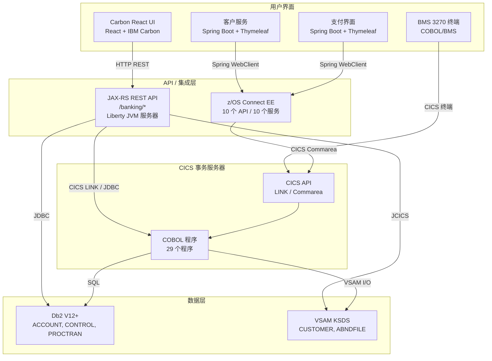
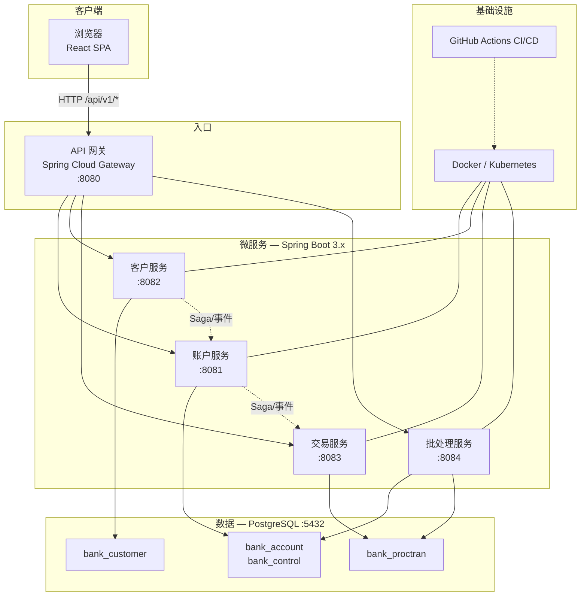

# ASDM 大型机现代化示例项目

> **[ASDM](https://asdm.ai)** (AI-First System Development Methodology) 是一种将 AI 置于软件开发生命周期核心的方法论 — 加速智能系统的开发、部署和维护。

> **中文版本** | **[English Version](README.md)**

这是一个使用 ASDM 大型机现代化工具集展示大型机到云现代化的示例项目。该仓库包含传统的 IBM CICS 银行示例应用程序及其现代化的云原生对应版本作为 git 子模块。

该项目为希望现代化其大型机工作负载的组织提供了端到端的参考。它涵盖了完整的转型旅程 — 从盘点遗留 COBOL 程序、BMS 映射集和 JCL 脚本，到架构设计、代码转换，最终实现完全容器化的云原生部署，运行在 x86 Linux 上。

## 仓库结构

该仓库使用 **git 子模块** 将传统和现代代码库保存在独立的、版本化的仓库中，同时为整个现代化示例提供单一入口点。

```
asdm-mainframe-modernizer-sample/
├── cics-banking-sample-application-cbsa/         ← 传统系统（子模块）
├── modern-cics-banking-sample-application-cbsa/  ← 现代系统（子模块）
└── README.md
```

| 子模块 | 描述 | 仓库 |
|--------|------|------|
| `cics-banking-sample-application-cbsa` | 传统的 IBM CICS 银行示例应用程序 — 在 z/OS 上运行的 COBOL/CICS/Db2/VSAM。包含 29 个 COBOL 程序、37 个复制本、9 个 BMS 映射集、102 个 JCL 脚本、JAX-RS REST API 和 z/OS Connect 服务定义。 | [ups216/cics-banking-sample-application-cbsa](https://github.com/ups216/cics-banking-sample-application-cbsa) |
| `modern-cics-banking-sample-application-cbsa` | 现代化的云原生银行应用 — 在 x86 Linux 上运行的 Spring Boot/React/PostgreSQL。包含 4 个 Spring Boot 微服务、API 网关、React SPA 前端、Flyway 迁移、Docker Compose 和 Kubernetes 清单。 | [ups216/modern-cics-banking-sample-application-cbsa](https://github.com/ups216/modern-cics-banking-sample-application-cbsa) |

## 现代化概览

下表总结了堆栈每一层的关键技术替换。每一行都代表了从大型机特定技术到开放、云原生等价物的根本转变 — 由 ASDM 大型机现代化工具集的自动转换规则驱动。

| 方面 | 之前（大型机） | 之后（现代） |
|------|---------------|-------------|
| **运行时** | z/OS 上的 CICS 事务服务器 | x86 Linux 上的 Spring Boot 3.x |
| **业务逻辑** | 29 个 COBOL 程序 | Java 17 / Spring 服务 |
| **数据结构** | 37 个 COBOL 复制本 | JPA 实体 / DTO |
| **用户界面** | 9 个 BMS 映射集（3270 终端） | React + TypeScript + Ant Design SPA |
| **数据库** | Db2 + VSAM KSDS | PostgreSQL |
| **批处理** | 102 个 JCL 脚本 | Spring Batch + GitHub Actions |
| **集成** | z/OS Connect EE | Spring Cloud Gateway |
| **部署** | z/OS LPAR | Docker / Kubernetes |

## 快速开始

### 克隆带子模块

由于此项目使用 git 子模块，您必须使用 `--recurse-submodules` 克隆以获取传统和现代代码库：

```bash
git clone --recurse-submodules git@github.com:ups216/asdm-mainframe-modernizer-sample.git
```

如果您已经克隆了但没有子模块，请初始化并更新它们：

```bash
git submodule init
git submodule update
```

稍后从两个子模块拉取最新更改：

```bash
git submodule update --remote
```

### 先决条件

- **Java 17+** (LTS) — 用于构建和运行 Spring Boot 服务
- **Maven 3.9+** — 用于后端构建和依赖管理
- **Node.js 20 LTS** — 用于构建 React 前端
- **Docker & Docker Compose** — 用于在本地运行完整堆栈

### 现代应用快速启动

运行现代化应用的最快方式是通过 Docker Compose，它会启动 PostgreSQL、所有微服务、API 网关和前端：

```bash
cd modern-cics-banking-sample-application-cbsa

# 构建后端
mvn clean package

# 构建前端
cd frontend && npm install && npm run build

# 使用 Docker Compose 运行
docker-compose up
```

有关完整详细信息，包括如何在开发环境中本地运行单个服务，请参阅 [modern-cics-banking-sample-application-cbsa/README.md](modern-cics-banking-sample-application-cbsa/README.md)。

## 架构

### 之前 — 大型机 (z/OS)

原始的 CBSA 运行在 IBM z/OS 上，使用 CICS 事务服务器作为运行时。它具有多层架构，具有 4 个不同的用户界面（BMS 3270 终端、Carbon React UI、客户服务和支付界面），都通过 CICS LINK 和 Commarea 访问共享的 COBOL 业务逻辑。数据存储在 Db2 关系表和 VSAM 键序数据集中。



**关键特性：**
- **单体 COBOL 核心** — 所有 29 个程序共享单个 CICS 地址空间，并通过 LINK/XCTL 和二进制 Commarea 进行通信
- **多个 UI 前端** — BMS 3270 用于传统终端访问，外加 3 个基于 Web 的界面运行在 Liberty JVM 服务器上
- **混合数据访问** — Db2 用于关系数据（ACCOUNT、PROCTRAN、CONTROL），VSAM KSDS 用于键控访问（CUSTOMER、ABNDFILE）
- **z/OS Connect 桥接** — 将 CICS 程序公开为 Spring Boot Web UI 的 REST API

### 之后 — 云原生 (x86 Linux)

现代化系统是一个云原生微服务架构，运行在 x86 Linux 上，使用 Docker 容器化，并在生产环境中由 Kubernetes 编排。它用 Spring Boot 服务、PostgreSQL 和统一的 React SPA 替换了单体 CICS/COBOL/Db2/VSAM 堆栈 — 所有这些都在 Spring Cloud Gateway API 网关后面。



**关键特性：**
- **微服务分解** — 4 个独立服务（账户、客户、交易、批处理），每个服务拥有自己的数据库模式（每个服务一个数据库模式）
- **API 网关路由** — 所有外部请求通过 Spring Cloud Gateway 的 `/api/v1/*` 进入，路由到适当的后端服务
- **统一 React SPA** — 用一个使用 TypeScript、Ant Design 和 Vite 的现代 Web 应用程序替换所有 4 个遗留 UI
- **PostgreSQL** — 替换 Db2 和 VSAM，使用具有 Flyway 管理迁移的适当索引关系表
- **Saga 模式** — 跨服务事务（例如，账户间资金转账）使用 Saga 编排和补偿事务以确保一致性
- **容器化部署** — 每个服务在自己的 Docker 容器中运行，在生产环境中由 Kubernetes 编排，通过 GitHub Actions 实现 CI/CD

## COBOL 到 Java 映射

传统系统中的每个 COBOL 程序都已转换为相应微服务中的 Java 服务方法。下表显示了主要的业务程序及其现代的 REST 端点等价物。此映射由 ASDM 大型机现代化工具集根据其自动转换规则生成（例如，CICS `LINK` → REST 调用，`COMMAREA` → JSON 请求/响应 DTO）。

| COBOL 程序 | 微服务 | REST 端点 |
|------------|--------|-----------|
| CREACC | 账户服务 | `POST /api/v1/accounts` |
| INQACC | 账户服务 | `GET /api/v1/accounts/{sortcode}/{number}` |
| UPDACC | 账户服务 | `PUT /api/v1/accounts/{sortcode}/{number}` |
| DELACC | 账户服务 | `DELETE /api/v1/accounts/{sortcode}/{number}` |
| CRECUST | 客户服务 | `POST /api/v1/customers` |
| INQCUST | 客户服务 | `GET /api/v1/customers/{sortcode}/{number}` |
| XFRFUN | 交易服务 | `POST /api/v1/transactions/transfer` |
| DBCRFUN | 交易服务 | `POST /api/v1/transactions/debit-credit` |

## BMS 到 React 映射

3270 终端 UI 中的每个 BMS（基本映射支持）映射集都已转换为 React 页面组件。转换遵循 ASDM 规则：`ATTRB=UNPROT` 的 BMS 字段变为可编辑的表单输入，`ATTRB=PROT` 变为只读显示，PF3 映射到返回按钮，PF5 映射到提交按钮。

| BMS 映射 | React 页面 | 路由 |
|----------|-----------|------|
| BNK1MAI (主菜单) | 主页 | `/` |
| BNK1CAM (创建账户) | 创建账户页面 | `/accounts/create` |
| BNK1CCM (创建客户) | 创建客户页面 | `/customers/create` |
| BNK1TFM (转账) | 转账页面 | `/transactions/transfer` |
| BNK1DAM (删除账户) | 删除账户页面 | `/accounts/delete` |
| BNK1DCM (删除客户) | 删除客户页面 | `/customers/delete` |
| BNK1UAM (更新账户) | 更新账户页面 | `/accounts/update` |

## 数据迁移

遗留数据层使用两种不同的存储技术 — Db2 用于关系表，VSAM KSDS 用于键控文件访问。两者都已合并到具有适当索引的 PostgreSQL 关系表中，以复制 VSAM 的基于键的访问模式。Flyway 管理所有模式迁移，每个服务独立拥有其数据库模式。

| 原始存储 | 表/文件 | PostgreSQL 表 | 关键更改 |
|----------|---------|---------------|----------|
| Db2 | ACCOUNT | `bank_account` | CHAR → VARCHAR；自动递增 ID；`created_at`/`updated_at` 时间戳 |
| Db2 | PROCTRAN | `bank_proctran` | 相同的类型调整；sortcode + number 的复合索引 |
| Db2 | CONTROL | `bank_control` | 最小更改；`name` 作为主键 |
| VSAM KSDS | CUSTOMER | `bank_customer` | VSAM → 关系；复合键（sortcode + customer_number）作为主键 |
| VSAM KSDS | ABNDFILE | `abend_log` | VSAM → 用于错误日志记录的关系表 |

## 许可证

此项目作为演示目的提供示例。传统的 CBSA 代码基于 [IBM CICS 银行示例应用程序](https://github.com/IBM/cics-banking-sample-application-cbsa)。

---

[English Version](README.md)